Pcap analysis

(Google authenticator incident)

Name: Youssef Mahmoud Elsaeed

<u>Required:</u>

- What is the IP address of the infected Windows client?

\>10.1.17.215

- What is the mac address of the infected Windows client?

\>00:d0:b7:26:4a:74

- What is the host name of the infected Windows client?

\> DESKTOP-L8C5GSJ

- What is the user account name from the infected Windows client?

\> shutdownson

- What is the likely domain name for the fake Google Authenticator page?

\> dyngate.com

- What are the IP addresses used for C2 servers for this infection?

\>5.252.153.241

<u>Steps:</u>

- So the first step was answering our first question which is the ip of
  the infected host.

- After applying the filter to narrow our lan segment, and search for
  the http requests with method get because in our scenario he did
  download a file so get was our solution “ip.src == 10.1.17.0/24
  &&http.request.method == "GET"” this filter helped us suspect the
  first question which is our infected machine.

- Then we’ve gone to the statistics -\> enpoints found the same
  suspected ip with super high traffic so we considered that ip as the
  infected machine:

  - 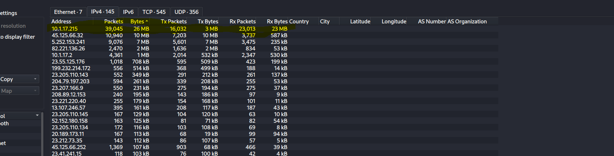

  - 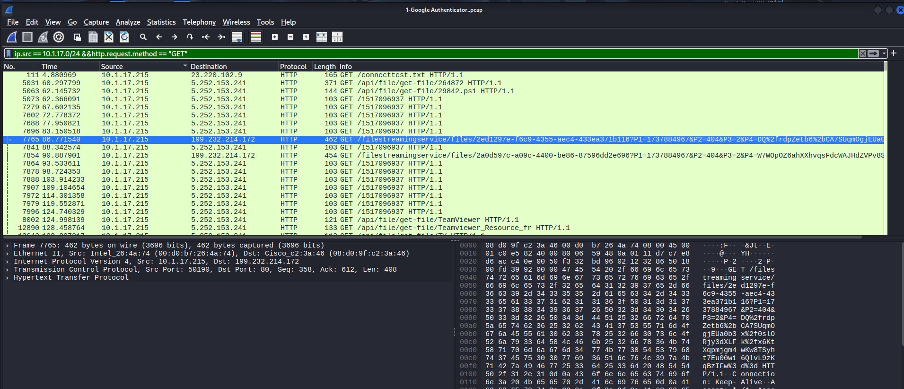

  - Infected host: 10.1.17.215

- Now to the second question which is mac address of that same infected
  host.

  - 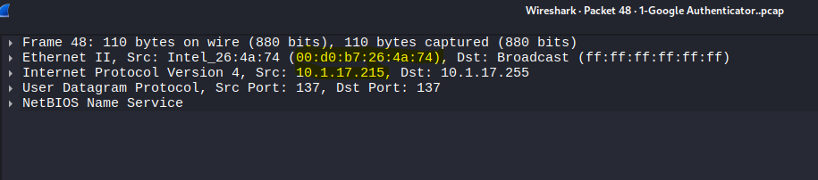

  - Our infected host’s mac address: 00:d0:b7:26:4a:74

- Now that we have both IP address and mac address we wanna answer the
  third question which is our host name.

- In the host name we did use another filter which is smb \|\| smb2 and
  tried to follow the tree view which led us into our domain controller
  connection, and we’re looking more to find the session setup start of
  the smb request from our infected machine to the domain controller so
  we’re moving right.

- So after inspecting more I’ve managed to find the hostname which is
  DESKTOP-L8C5GSJ

  - 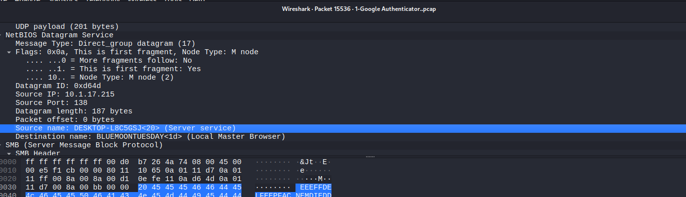

  - 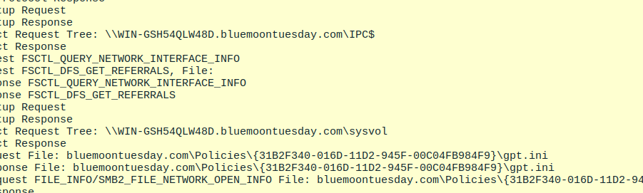

- Now that we’ve managed to get the hostname to the upcoming task which
  is find the account name.

- At first I’ve tried to look for the session setup sessions with the
  smb2 filter as the last if the account name could be there but failed

- After trying and learning some filters I learnt that Kerberos
  authentication packets could be having the account name as Cname and
  Sname, so applied that filter “kerberos.msg_type == 10 && ip.src ==
  10.1.17.215” after a couple of packets inspected found it in the cname
  string key.

  - 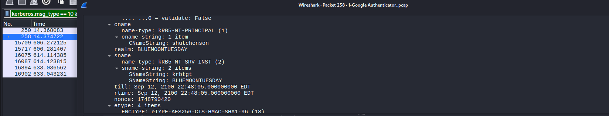

  - Account name: shutdownson

- Now we are approaching the last two steps which is the fake google
  authenticator domain, and the c2 server(any external connection ip
  suspected)

- Now let’s go through the first which is finding the domain of the fake
  site, and at the first glance we could think that it could be looked
  up for after we suspect an ip, but this lab could be solved using only
  wireshark so that means that we could find the domain name somewhere.

- So our basic beginning with the first filter the http requests to
  which our infected ip is the src “http && ip.src == 10.1.17.215” I
  tried to look for malicious get (download) files or any host headers
  in those requests.

- While inspecting those requests I already suspected the C2 ip which
  had so much traffic with our infected machine suspected :
  5.252.153.241.

- Suspected this domain as the fake google authentication page:
  dyngate.com while was using another filter which “dns && ip.src ==
  10.1.17.215” to see the names that of the domains the dns redirected
  us to. Probably dyngate.com is the domain name answer because there
  was enormous traffic with our infected machine.

  - 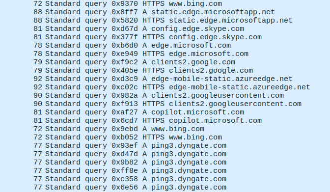

  - 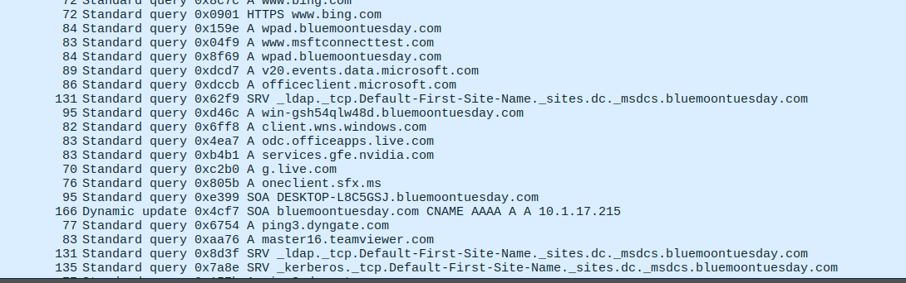

  - Wanted to be more sure that that domain had so much traffic outgoing
    from our infected machine to it so applied that filter “dns.qry.name
    contains "dyngate.com"&& ip.src == 10.1.17.215” and looked the
    results:

    - 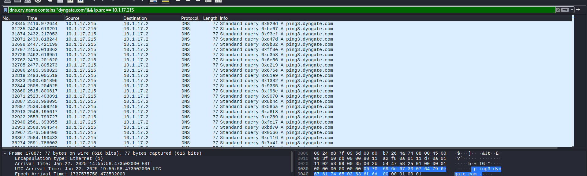

    - So now we are kinda sure it’s the suspected domain.

    - We also have another clue that this site is connected to our
      machine on an unused port number :

      - 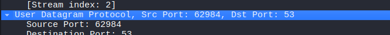

    - Now used the dns filter but without checking if our infected ip is
      the source to be so so sure:

      - 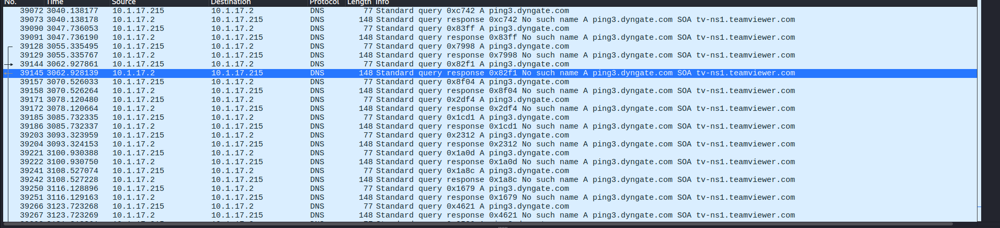

- So as we want atleast to make sure of the last question which is the
  C2 (command and control center) (The puppet controller), as I had
  suspected already an ip address to be a C2 and the idea of a c2 ip is
  that It would be an ip that our machine connects to and sends traffic
  to that isn’t on our system so applied the following filter “ip.src ==
  10.1.17.215 && !ip.dst == 10.117.0.0/16” and I did find interesting
  finding:

  - 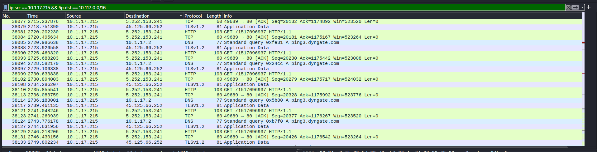

  - It shows relation between our suspected domain and suspected c2
    server.

- Now we can be more sure but also skeptical that this is our c2 server:
  5.252.153.241

Final:

Now we did finish the whole lab with our intuition and basic inspection
technique learning more and more about the analysis using wire shark and
learnt so much new filters and filtering techniques that really did
benefit me, but am still not totally sure that my answers is right.
