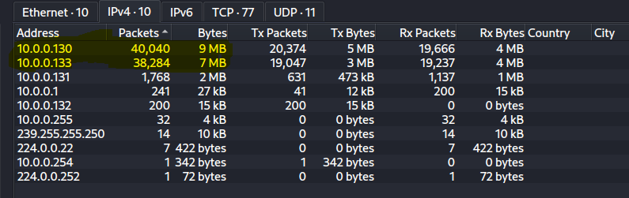
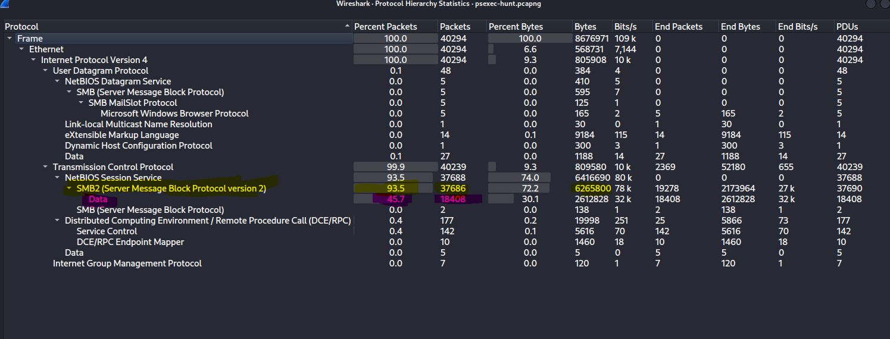
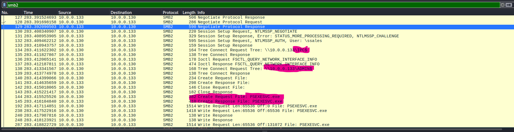
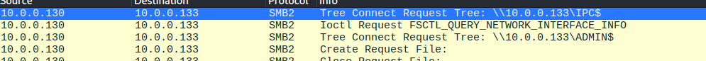
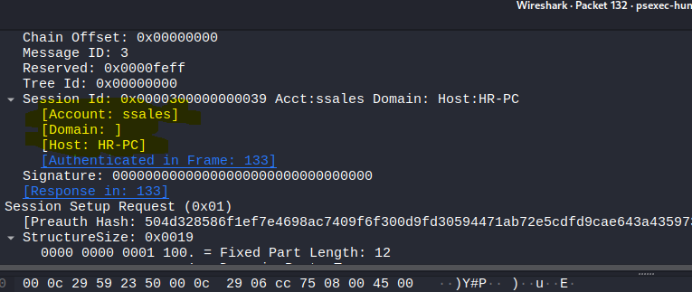
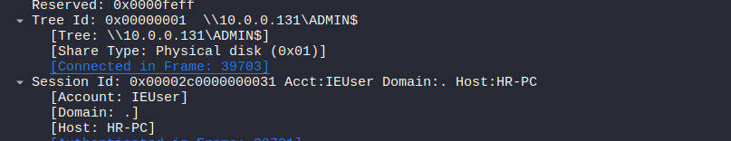
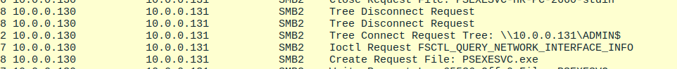
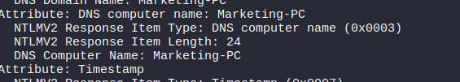
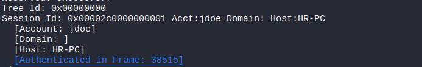

Pcap analysis

(Suspicious Psexec lateral movement)

Name: Youssef Mahmoud Elsaeed

<u>Scenario:</u>

An alert from the Intrusion Detection System (IDS) flagged suspicious
lateral movement activity involving PsExec. This indicates potential
unauthorized access and movement across the network. As a SOC Analyst,
your task is to investigate the provided PCAP file to trace the
attacker’s activities. Identify their entry point, the machines
targeted, the extent of the breach, and any critical indicators that
reveal their tactics and objectives within the compromised environment.

First let’s talk about psexec:

- **PsExec** is a command-line tool from Microsoft’s **Sysinternals
  Suite**

- Its purpose: allows an administrator (or attacker) to execute
  processes on a remote Windows machine as if sitting at its console.

- Example Usage: psexec \\target -u user -p password cmd.exe

How it works under the hood?

- Authentication via SMB

  - PsExec connects to the target machine using the Server Message Block
    (SMB) protocol, specifically port 445.

  - It authenticates with valid username/password or NTLM hash
    (Pass-the-Hash attacks).

- File Transfer

  - PsExec copies a service executable (psexesvc.exe) over to the target
    system’s ADMIN\$ share (hidden administrative SMB share).

- Service Creation

  - It creates and runs a Windows service (psexesvc) on the target
    system using the Service Control Manager (SCM).

  - This service executes the command you specified.

- Output Redirection

  - PsExec redirects the standard input/output between your console and
    the target system’s process.

  - This is how you see the remote cmd.exe on your local machine

Now what could blue team /defenders do with that info:

- Detect PsExec by monitoring for:

  - Creation of psexesvc.exe.

  - Event IDs related to remote service creation (Windows Event 7045).

  - SMB session traffic between workstations.

To the final info (studying) needed: what is C\$, IPC\$, Admin\$?

- default administrative shares in Windows

- C\$

  - Refers to the root of the C: drive.

  - The \$ at the end makes it a hidden share (not visible when browsing
    shares).

  - Example: \\MACHINE_NAME\C\$

  - lets an administrator remotely access the C: drive.

  - Purpose: allows system administrators (and sometimes attackers) to
    manage the entire filesystem remotely.

- IPC\$ (Inter-Process Communication Share)

  - A special share used for named pipes.

  - Doesn’t map to a real folder — it’s virtual.

  - Used for:

    - Remote management

    - Authentication

    - Communication between processes

  - Attackers often abuse IPC\$ for null sessions (unauthenticated
    access) in older Windows systems.

  - Example usage: net use \\TARGET\IPC\$ /u:Administrator password

- ADMIN\$

  - Refers to the Windows system root directory (usually C:\Windows).

  - Used by remote administration tools (PsExec, SCCM, etc.).

  - When PsExec runs:

    - It connects to \\TARGET\ADMIN\$

    - Drops psexesvc.exe there

    - Then executes it as a service

<u>Required:</u>

1\) can you identify the IP address of the machine from which the
attacker initially gained access?

\>10.0.0.133( Initially gained access), 10.0.0.130(Attacker’s machine)

2\) can you determine the machine's hostname to which the attacker first
pivoted?

\>10.0.0.133(HR-PC)

3\) What is the username utilized by the attacker for authentication?

\>SSales

4\) After figuring out how the attacker moved within our network, we
need to know what they did on the target machine. What's the name of the
service executable the attacker set up on the target?

\>Psexec.exe

5)Which network share was used by PsExec to install the service on the
target machine

\>ADMIN\$

6\) We must identify the network share used to communicate between the
two machines. Which network share did PsExec use for communication?

\>\$IPC

7\) Now that we have a clearer picture of the attacker's activities on
the compromised machine, it's important to identify any further lateral
movement. What is the hostname of the second machine the attacker
targeted to pivot within our network?

\>10.0.0.131(MARKETING-PC)

<u>Steps:</u>

- After I’ve opened the pcap file that involves a lateral movement
  through the psexec, I’ve learnt some stuff during the research we’ve
  made during the training which is the smb protocol and it’s relation
  to psexec, and the smb filters in wireshark, so that is the first idea
  I thought of but before even filtering I applied what I learnt too, to
  check statistics tab first for any anomaly:

  - Checked the statistics \> endpoints first.

  - Noticed anomaly ofcourse that two ips was suspected of data
    exfilteration maybe, there was huge data transmitted through
    traffic:

  - 

  - The suspected Ips: 10.0.0.130, 10.0.0.133.

- Then checked the second statistic wanted to check which is the
  protocol hierarchy to even make sure that there was smb protocol used.

  - 

  - 93.5 percent of the packets were moved using smb protocol so this is
    certainly our filter to go to and as the scenario said psexec
    potentially used by an attacker and I suspect that he exfilterated a
    lot of data maybe accessing the root of the directories \$C, \$D or
    something just an intuition.

- So now to our go to filter which is “smb” version 2.

  - Look at that fine results that is so rich with info:

  - 

  - 

  - Notice first that our two suspected IPs from the statistics is the
    two that is contacting through smb protocol, so we are moving right,
    but the question who is the attacker? The one who initiated the
    protocol request which is 10.0.0.130

  - The second fine info is the hidden directories that the attacker is
    seeking to view as I highlighted them: \$IPCS, ADMIN\$.

  - The third note is the creation of the PSEXEC.exe.

- Now before we dive in answered the first question which is 10.0.0.130
  the first machine the attack was initiated from, and the victim was
  10.0.0.133.

- And while inspecting the ntlmssp_auth packet to check for more info
  found in the packet details our answer for question 2 which is the
  machine’s hostname:

  - 

  - But that didn’t end in question 2 it took us to question 3 which is
    the username utilized by attacker for authentication which is
    SSales.

- Now with question 4, 5 and 6 which we all conducted through our study
  and analyses for only those initial parts of the file as we know the
  shares: ADMIN\$, The \$IPC and what exactly does Psexec do which is
  launching psexec.exe executable through smb on ADMIN\$, and \$IPC
  share is used for communicating and as we saw in the packets it came
  \$IPC tree request, then ADMIN\$ tree request then creation of
  psexec.exe so we have the answer to Q4, Q5 and Q6 now, but let’s keep
  going inspecting the other traffic.

- Now with our final question which is what was the second machine’s
  host name that the attacker pivoted to?

- Noticed many stdout and stdin requests which means ofcourse data
  exfilteration happened.

- Okay there was a bit of confusion because I found the second ip
  address the attacker pivoted too and was with another username which
  is “J.doe” and the third was “IEUSER” with ip 10.0.0.131 but the
  confusion was that the host name were always HR-PC so after a bit
  research I found out that this can happened cause of cloning : The
  metadata for the psexec.exe service (like the "Host" name in its
  description) can sometimes be inherited from the machine it was
  compiled on or the machine from which it was launched. If the attacker
  initially compromised HR-PC (10.0.0.133), downloaded PSEXESVC.exe from
  it, and then used *that same file* to attack 10.0.0.131, the file
  itself might still contain the original hostname HR-PC in its
  metadata.

  - 

  - 

- OOOOOOOOPssssss!!!

- Sorry after a bit of inspection found out that I was looking in the
  wrong place because as I said earlier the host name was inherited from
  the previous machine psexec.exe ran on but as I inspected the ntlm
  authentication headers down I found out that the second machine’s host
  name was MARKETING – PC

  - 

  - 

  - With account name JDOE as we said upthere .

- So now we’ve finished the lab tasks and had a full picture of that
  attack.

<u>Final:</u>

Now to a lesson learnt and implications as a security defender:

- Monitor for access to these shares → especially ADMIN\$.

- Disable administrative shares when not needed.

- Restrict SMB (port 445) to only trusted management networks.
