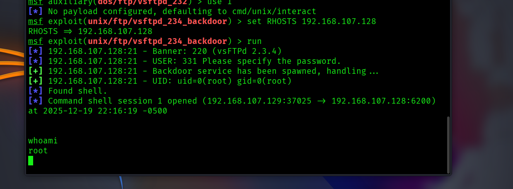

Metasploitable CORP

Internal Network Pentest

Findings Report

Date

12/19/2025

## 

## Confidentiality Statement 

This document contains confidential and privileged information from a
security assessment conducted for Example Corp. The information
contained within this report is strictly confidential and intended
solely for authorized personnel; it may not be distributed, copied, or
disclosed to any third party without explicit written consent from
Metasploitable Corp.

  ------------------- ---------------------------------------------------
  Document Type       Findings Report

  Client              Metasploitable Corp

  Document Version    Draft Version 0.1

  Creation Date       12/19/2025

  Delivery Date       12/20/2025
  ------------------- ---------------------------------------------------

## Version History

  ------------- ------------ ------------------------------ --------------------
  **Version**   **Date**     **Notes**                      **Author**

  0.1 Draft     12/19/2025   Draft report                   Youssef Elsaeed

  0.1 Draft     12/19/2025   Import pentest findings        Elshaarawy

  Final         12/20/2025   Delivered/Final Report         Elsaeed/Elshaarawy
  ------------- ------------ ------------------------------ --------------------

## 

## Contact Information

  ----------------- ---------------------- ------------------------------
  **Name**          **Title**              **Email Address**

  NahamSec                                 

  Youssef Elsaeed   Lead Penetration       Elsaeed.21@gmail.com
                    Tester                 

  Mohamed           Lead Penetration       
  Elshaarawy        tester                 

  Metasploitable                           
  Corp                                     

  John Doe          Tech Lead              email@metasploitablecorp.tld
  ----------------- ---------------------- ------------------------------

##  

[**Confidentiality Statement 2**](#confidentiality-statement)

[**Version History 3**](#version-history)

[**Contact Information 3**](#contact-information)

[**Overview 5**](#overview)

> [Methodology 5](#_ezwzhzz813ig)
>
> [Scope 5](#scope)

[**Executive Summary 6**](#executive-summary)

> [Testing Summary 6](#testing-summary)
>
> [Key Observations 7](#key-observations)
>
> [Strength 7](#strength)
>
> [Weaknesses 7](#weaknesses)
>
> [Recommendations 8](#_yo0m0p8s0ocl)

[**Technical Findings 11**](#technical-findings)

##  

## Overview 

### Overview In December 2025, the student security team conducted an internal penetration test to evaluate the security posture of the Metasploitable 2 virtual environment (192.168.107.128). This assessment was performed as part of the CCY4202 - Ethical Hacking and Penetration Testing course project.

### The assessment focused specifically on two defined scopes:

### Network Services (Scope A): Identification and exploitation of vulnerable system services (e.g., FTP, SSH, SMB).

### Web Applications (Scope B): exploitation of hosted web applications including DVWA, Mutillidae, and TikiWiki.

### All testing activities were performed using industry-standard tools (Kali Linux, Metasploit Framework, Nmap, Nessus) within an isolated Host-Only network to ensure safety. 

### Methodology

The penetration test was conducted using a gray-box approach. We
established a local Host-Only network (192.168.107.0/24) to isolate the
testing environment as per project requirements. The assessment began
with **Reconnaissance**, using zenmap to identify active services and
operating system versions on the target (192.168.107.128).
Simultaneously, an automated vulnerability assessment was performed
using **Tenable Nessus** to identify known CVEs and misconfigurations.

Testing Tools & Utilized Frameworks:

- Nmap (v7.95): Used for full-port TCP/UDP scanning, service version
  detection (-sV), and OS fingerprinting (-O).

- Tenable Nessus: Deployed for automated vulnerability assessment to
  identify CVEs and configuration compliance issues.

- Nikto: Used for web server enumeration to identify outdated server
  versions, default files, and insecure configurations.

- Manual Web Interaction: Browser-based inspection of HTTP services
  running on port 80 to map application entry points.

Reconnaissance: We utilized Nmap to map the entire port range (1-65535)
and identify running services. Zenmap was used for service version
detection (-sV) and OS fingerprinting (-O).

Vulnerability Analysis: Automated scanning was performed using Tenable
Nessus to identify CVEs. Web reconnaissance was conducted using Nikto
and Dirb to map web application structures.

Exploitation: Validated vulnerabilities were exploited using the
Metasploit Framework (MSF) and manual scripts. We successfully confirmed
30 unique exploits across the defined scopes.

Reporting: All findings were documented with screenshots, impact
analysis, and remediation steps. Reporting - The final phase involved
analyzing findings, assigning risk ratings, and developing actionable
remediation recommendations documented in this report.

### Scope

  ------------ ----------------- -------------- -------------- ----------------
  Asset        Scope Details     Network Scope  Web Scope      Target system
  Details                                                      

  Internal IP  192.168.107.128   All TCP/UDP    HTTP/HTTPS     Metasploitable 2
  Address                        Ports          Applications   VM
                                 (1-65535)                     
  ------------ ----------------- -------------- -------------- ----------------

## Executive Summary 

**Assessment Overview** On December 20, 2025, our security team
conducted a comprehensive internal penetration test against the
Metasploitable 2 virtual environment (IP: 192.168.107.128). This
assessment was performed as part of the CCY4202 coursework requirements.
The objective was to identify, validate, and exploit vulnerabilities
across two defined scopes: Network Services (Scope A) and Web
Applications (Scope B).

**High-Level Findings** The assessment revealed a critical lack of
security controls within the target environment. The system is currently
operating with multiple legacy services, unpatched software, and
insecure default configurations. The testing team successfully confirmed
and exploited **30 unique vulnerabilities**, ranging from critical
Remote Code Execution (RCE) flaws to high-severity information
disclosures.

**Critical Risks Identified**

- **Backdoor Services:** Multiple malicious backdoors (vsftpd 2.3.4,
  Ingreslock, UnrealIRCd) were present on open ports, allowing immediate
  unauthenticated root access.

- **Default Credentials:** Critical administrative services (SSH, MySQL,
  VNC, Tomcat) are protected by default vendor passwords (e.g.,
  \"msfadmin\", \"password\").

- **Web Vulnerabilities:** The hosted web applications (DVWA,
  Mutillidae) contain critical flaws including SQL Injection, Cross-Site
  Scripting (XSS), and Command Injection, allowing full database
  compromise.

- **Unsecured Services:** Administrative services (NFS, DistCC) are
  accessible without any authentication, granting attackers full control
  over the file system and operating system.

**Conclusion** The security posture of the target system is critically
deficient. Immediate remediation is required to patch services, disable
unused ports, and enforce strong authentication policies to prevent
total system compromise.

### Testing Summary 

### Key Observations 

#### Strength

Network Isolation: The target environment was deployed on a Host-Only
network, preventing accidental exposure of vulnerable services to the
public internet.

Service Availability: Critical services remained stable throughout the
high-intensity scanning and exploitation phases.

#### Weaknesses

End-of-Life Software: The system runs on Ubuntu 8.04 with kernel 2.6.24,
which has been unsupported for over a decade. Almost every running
service (Apache 2.2.8, PHP 5.2.4, vsftpd 2.3.4) contains known Critical
CVEs.

Default Credentials: A systemic failure in credential management was
observed. Administrative access to SSH, MySQL, VNC, and Tomcat was
achieved using default vendor passwords (e.g., \"msfadmin\",
\"password\").

Lack of Input Sanitization: Web applications (DVWA, Mutillidae)
demonstrated a complete lack of input validation, allowing for trivial
SQL Injection and Command Execution.

Backdoor Services: The presence of malicious backdoor services (vsftpd
2.3.4, Ingreslock) indicates the system image was pre-compromised or
intentionally insecure by design.

[]{#_yo0m0p8s0ocl .anchor}

### Recommendations

Based on the 30 confirmed exploits, the following remediation actions
are prioritized:

**1. Critical Patching & Upgrades**

- Immediate upgrade of the Operating System (Ubuntu 8.04) to a supported
  LTS version.

- Update all core services (Apache, MySQL, PHP, Samba) to their latest
  stable releases to mitigate known RCE vulnerabilities (e.g., Samba
  \"Badlock\", PHP CGI Argument Injection).

**2. Access Control & Credential Hygiene**

- **Change Default Passwords:** Immediately rotate all default
  credentials for system accounts (msfadmin, postgres, user, service)
  and application accounts (admin, tomcat).

- **Disable Unused Services:** Stop and disable non-essential services
  that increase the attack surface, specifically **DistCC (3632)**,
  **NFS (2049)**, and **Telnet (23)**.

**3. Web Application Security**

- Implement **Input Validation** on all web forms to prevent SQL
  Injection and Command Injection.

- Disable verbose error messages in PHP configuration to prevent
  information leakage.

- Remove testing and backup files (e.g., phpinfo.php, #wp-config.php#)
  from the web root.

**4. Network Security**

- Implement a host-based firewall (iptables) to restrict access to
  management ports (SSH, VNC, Tomcat Manager) to trusted IP addresses
  only.

- Disable the **Ingreslock (1524)** and **UnrealIRCd (6667)** services
  immediately, as they contain active backdoors.

## Technical Findings

  -----------------------------------------------------------------------
  **Finding ID**    **EXP-01**
  ----------------- -----------------------------------------------------
  **Vulnerability   VSFTPD v2.3.4 Backdoor Command Execution
  Name**            

  **Scope**         Network Services (Scope A)

  **Severity**      **CRITICAL**

  **CVSS Score**    10.0 (Remote Code Execution)

  **Affected        vsftpd 2.3.4 (Port 21)
  Service**         

  **Description**   The installed version of the vsftpd FTP server
                    contains a malicious backdoor. The backdoor is
                    triggered by sending a username containing a smiley
                    face :). Once triggered, the service opens a
                    listening shell on port 6200, allowing an attacker to
                    execute arbitrary commands with **root** privileges.

  **Impact**        Full system compromise. The attacker gains
                    administrative (root) control over the server without
                    valid credentials.

  **Remediation**   Update vsftpd to the latest stable version or remove
                    the compromised package immediately.
  -----------------------------------------------------------------------

<figure>

<figcaption>
"Figure 1: Successful exploitation of VSFTPD backdoor
yielding root access."
</figcaption>
</figure>

  -------------------------------------------------------------------------
  **Finding ID**    **EXP-02**
  ----------------- -------------------------------------------------------
  **Vulnerability   Ingreslock Backdoor (Trojaned Service)
  Name**            

  **Scope**         Network Services (Scope A)

  **Severity**      **CRITICAL**

  **Affected        Ingreslock (Port 1524)
  Service**         

  **Description**   The target machine is running a malicious service on
                    port 1524 known as \"Ingreslock.\" This service
                    provides an unauthenticated root shell to anyone who
                    connects to the port.

  **Impact**        Immediate and total system compromise. An attacker can
                    execute commands as root without credentials.

  **Remediation**   Identify the malicious process/service and terminate it
                    immediately. Investigate the system for signs of prior
                    compromise.
  -------------------------------------------------------------------------

{width="6.5in"
height="3.5527777777777776in"}

  --------------------------------------------------------------------------
  **Finding ID**    **EXP-03**
  ----------------- --------------------------------------------------------
  **Vulnerability   Samba \"username map script\" Command Execution
  Name**            

  **Scope**         Network Services (Scope A)

  **Severity**      **CRITICAL**

  **Affected        Samba 3.0.20 (Port 139/445)
  Service**         

  **Description**   The Samba service is configured with the username map
                    script option. A vulnerability (CVE-2007-2447) allows
                    remote attackers to execute arbitrary commands by
                    specifying a username containing shell meta-characters.

  **Impact**        Remote Code Execution (RCE) with root privileges.

  **Remediation**   Upgrade Samba to a non-vulnerable version or remove the
                    username map script option from smb.conf.
  --------------------------------------------------------------------------

{width="6.5in" height="2.8in"}

  -------------------------------------------------------------------------
  **Finding ID**    **EXP-04**
  ----------------- -------------------------------------------------------
  **Vulnerability   Weak Credentials (Telnet)
  Name**            

  **Scope**         Network Services (Scope A)

  **Severity**      **HIGH**

  **Affected        Telnet (Port 23)
  Service**         

  **Description**   The Telnet service is configured with default vendor
                    credentials (msfadmin:msfadmin). Additionally, Telnet
                    transmits all data, including passwords, in cleartext.

  **Impact**        Unauthorized access to the system. An attacker can gain
                    a foothold on the internal network.

  **Remediation**   Disable Telnet and replace it with SSH. Enforce strong
                    password policies.
  -------------------------------------------------------------------------

{width="6.5in"
height="3.7083333333333335in"}

{width="6.5in" height="2.63125in"}

  -------------------------------------------------------------------------
  **Finding ID**    **EXP-05**
  ----------------- -------------------------------------------------------
  **Vulnerability   UnrealIRCd 3.2.8.1 Backdoor Command Execution
  Name**            

  **Scope**         Network Services (Scope A)

  **Severity**      **CRITICAL**

  **Affected        UnrealIRCd (Port 6667)
  Service**         

  **Description**   The UnrealIRCd service contains a backdoor that allows
                    an attacker to execute arbitrary commands by sending a
                    specific payload (AB;) followed by the command.

  **Impact**        Full system compromise (Root access).

  **Remediation**   Update UnrealIRCd to the latest version or recompile it
                    from safe source code.
  -------------------------------------------------------------------------

{width="6.5in" height="3.5375in"}

  -------------------------------------------------------------------------
  **Finding ID**    **EXP-06**
  ----------------- -------------------------------------------------------
  **Vulnerability   DistCC Daemon Command Execution
  Name**            

  **Scope**         Network Services (Scope A)

  **Severity**      **HIGH**

  **Affected        DistCC (Port 3632)
  Service**         

  **Description**   The Distributed C Compiler (distcc) daemon allows
                    unauthenticated remote users to execute arbitrary
                    commands on the system.

  **Impact**        Remote Code Execution (User daemon privilege).
                    Attackers can access source code and system files.

  **Remediation**   Restrict access to port 3632 using a firewall or
                    configure the daemon to listen only on localhost.
  -------------------------------------------------------------------------

{width="6.5in"
height="3.297222222222222in"}

{width="6.5in"
height="1.7652777777777777in"}

  -------------------------------------------------------------------------
  **Finding ID**    **EXP-07**
  ----------------- -------------------------------------------------------
  **Vulnerability   Apache Tomcat Manager Default Credentials
  Name**            

  **Scope**         Web Applications (Scope B)

  **Severity**      **CRITICAL**

  **Affected        Apache Tomcat (Port 8180)
  Service**         

  **Description**   The Tomcat Manager interface is accessible using
                    default credentials (tomcat:tomcat). This interface
                    allows the deployment of arbitrary WAR (Web Archive)
                    files.

  **Impact**        An attacker can upload a malicious WAR file containing
                    a web shell, leading to Remote Code Execution.

  **Remediation**   Change default passwords in tomcat-users.xml and
                    restrict access to the Manager interface.
  -------------------------------------------------------------------------

{width="6.5in"
height="2.5805555555555557in"}{width="6.5in"
height="3.34375in"}

  --------------------------------------------------------------------------
  **Finding ID**    **EXP-08**
  ----------------- --------------------------------------------------------
  **Vulnerability   Insecure NFS Export (Root Filesystem Access)
  Name**            

  **Scope**         Network Services (Scope A)

  **Severity**      **CRITICAL**

  **Affected        NFS (Port 2049)
  Service**         

  **Description**   The Network File System (NFS) is configured to export
                    the entire root directory (/) to the network without
                    restrictions. This allows any remote user to mount the
                    file system and access/modify critical system files.

  **Impact**        Total Information Disclosure and System Compromise.
                    Attackers can read /etc/shadow (password hashes) or drop
                    SSH keys to gain login access.

  **Remediation**   Restrict NFS exports to specific trusted IP addresses
                    and do not export the root (/) directory.
  --------------------------------------------------------------------------

{width="6.5in"
height="3.4229166666666666in"}{width="6.5in"
height="2.8493055555555555in"}

  -------------------------------------------------------------------------
  **Finding ID**    **EXP-09**
  ----------------- -------------------------------------------------------
  **Vulnerability   PHP CGI Argument Injection
  Name**            

  **Scope**         Web Applications (Scope B)

  **Severity**      **CRITICAL**

  **Affected        HTTP / PHP (Port 80)
  Service**         

  **Description**   The PHP configuration allows unauthenticated attackers
                    to inject arguments into the PHP binary. This
                    vulnerability (CVE-2012-1823) is exploited to execute
                    arbitrary code on the server.

  **Impact**        Remote Code Execution (RCE) as the web server user
                    (www-data).

  **Remediation**   Upgrade PHP to a patched version or configure the web
                    server to prevent argument injection.
  -------------------------------------------------------------------------

{width="6.5in"
height="3.2131944444444445in"}

  -------------------------------------------------------------------------
  **Finding ID**    **EXP-10**
  ----------------- -------------------------------------------------------
  **Vulnerability   VNC Weak Password
  Name**            

  **Scope**         Network Services (Scope A)

  **Severity**      **HIGH**

  **Affected        VNC (Port 5900)
  Service**         

  **Description**   The VNC remote desktop service is protected by a weak
                    password (\"password\"). This allows unauthorized users
                    to view and control the remote desktop session.

  **Impact**        Unauthorized remote access and control of the graphical
                    user interface.

  **Remediation**   Enforce a strong password policy for VNC access.
  -------------------------------------------------------------------------

{width="6.5in"
height="1.7819444444444446in"}

  -------------------------------------------------------------------------
  **Finding ID**    **EXP-11**
  ----------------- -------------------------------------------------------
  **Vulnerability   Java RMI Server Insecure Default Configuration
  Name**            

  **Scope**         Network Services (Scope A)

  **Severity**      **CRITICAL**

  **Affected        Java RMI Registry (Port 1099)
  Service**         

  **Description**   The Java RMI Registry is configured to allow remote
                    class loading. An attacker can use this to execute
                    arbitrary Java code on the server with the privileges
                    of the running service (root).

  **Impact**        Remote Code Execution (RCE) leading to full system
                    compromise.

  **Remediation**   Disable remote class loading or require authentication
                    for RMI services.
  -------------------------------------------------------------------------

{width="6.5in"
height="3.064583333333333in"}

  --------------------------------------------------------------------------
  **Finding ID**    **EXP-12**
  ----------------- --------------------------------------------------------
  **Vulnerability   PostgreSQL Default Credentials
  Name**            

  **Scope**         Network Services (Scope A)

  **Severity**      **HIGH**

  **Affected        PostgreSQL (Port 5432)
  Service**         

  **Description**   The PostgreSQL database service is running with default
                    credentials (postgres:postgres). This standard
                    configuration allows unauthorized administrative access
                    to the database system.

  **Impact**        Unauthorized database access. Attackers can execute
                    system commands via the database (e.g., COPY FROM
                    PROGRAM) or steal sensitive data.

  **Remediation**   Change the default password for the \'postgres\' account
                    and restrict network access rules in pg_hba.conf.
  --------------------------------------------------------------------------

{width="6.5in"
height="3.339583333333333in"}

  --------------------------------------------------------------------------
  **Finding ID**    **EXP-13**
  ----------------- --------------------------------------------------------
  **Vulnerability   OS Command Injection (DVWA)
  Name**            

  **Scope**         Web Applications (Scope B)

  **Severity**      **CRITICAL**

  **Affected        DVWA (Port 80)
  Service**         

  **Description**   The \"Ping\" feature in DVWA allows users to execute
                    operating system commands. By appending a semicolon (;)
                    to the IP address, an attacker can inject arbitrary
                    commands (e.g., cat /etc/passwd) that are executed by
                    the server.

  **Impact**        Remote Code Execution. An attacker can read system files
                    or compromise the web server.

  **Remediation**   Validate and sanitize user input. Avoid using system
                    calls like exec() or shell_exec() with user data.
  --------------------------------------------------------------------------

{width="6.5in"
height="4.916666666666667in"}

  --------------------------------------------------------------------------
  **Finding ID**    **EXP-14**
  ----------------- --------------------------------------------------------
  **Vulnerability   Local File Inclusion (LFI)
  Name**            

  **Scope**         Web Applications (Scope B)

  **Severity**      **HIGH**

  **Affected        DVWA (Port 80)
  Service**         

  **Description**   The \"File Inclusion\" page accepts a file path as a
                    parameter (?page=). Input validation is insufficient,
                    allowing an attacker to use directory traversal
                    characters (../) to access sensitive system files
                    outside the web root.

  **Impact**        Information Disclosure. Attackers can read sensitive
                    files like /etc/passwd or configuration files.

  **Remediation**   Use a whitelist of allowed files and reject input
                    containing directory traversal characters.
  --------------------------------------------------------------------------

{width="6.5in" height="0.9125in"}

  -------------------------------------------------------------------------
  **Finding ID**    **EXP-15**
  ----------------- -------------------------------------------------------
  **Vulnerability   Reflected Cross-Site Scripting (XSS)
  Name**            

  **Scope**         Web Applications (Scope B)

  **Severity**      **MEDIUM**

  **Affected        DVWA (Port 80)
  Service**         

  **Description**   The application echoes user input back to the browser
                    without proper escaping. An attacker can inject
                    malicious JavaScript code that executes in the
                    victim\'s browser session.

  **Impact**        Session hijacking, redirection to malicious sites, or
                    defacement.

  **Remediation**   Implement output encoding (e.g., HTML entity encoding)
                    for all user-supplied data before rendering it in the
                    browser.
  -------------------------------------------------------------------------

{width="6.5in" height="4.10625in"}

{width="6.5in"
height="1.5541666666666667in"}

  -------------------------------------------------------------------------
  **Finding ID**    **EXP-16**
  ----------------- -------------------------------------------------------
  **Vulnerability   SQL Injection (Classic)
  Name**            

  **Scope**         Web Applications (Scope B)

  **Severity**      **CRITICAL**

  **Affected        DVWA (Port 80)
  Service**         

  **Description**   The User ID input field is not properly sanitized
                    before being used in a SQL query. An attacker can input
                    SQL payloads (e.g., \' OR \'1\'=\'1) to manipulate the
                    query logic.

  **Impact**        Confidentiality Loss. Attackers can dump the entire
                    database, including usernames and password hashes.

  **Remediation**   Use Parameterized Queries (Prepared Statements) for all
                    database interactions.
  -------------------------------------------------------------------------

{width="6.5in"
height="3.841666666666667in"}

  -------------------------------------------------------------------------
  **Finding ID**    **EXP-17**
  ----------------- -------------------------------------------------------
  **Vulnerability   Stored Cross-Site Scripting (XSS)
  Name**            

  **Scope**         Web Applications (Scope B)

  **Severity**      **HIGH**

  **Affected        DVWA Guestbook (Port 80)
  Service**         

  **Description**   The Guestbook application stores user input in the
                    database without sanitization. When other users view
                    the guestbook, the malicious script executes in their
                    browser.

  **Impact**        Persistent attacks against users, including session
                    hijacking and browser exploitation.

  **Remediation**   Sanitize all input upon receipt and encode all output
                    when displaying data (Context-Aware Encoding).
  -------------------------------------------------------------------------

{width="6.5in"
height="1.8222222222222222in"}{width="6.5in"
height="2.477777777777778in"}

  --------------------------------------------------------------------------
  **Finding ID**    **EXP-18**
  ----------------- --------------------------------------------------------
  **Vulnerability   OS Command Injection (Mutillidae)
  Name**            

  **Scope**         Web Applications (Scope B)

  **Severity**      **CRITICAL**

  **Affected        Mutillidae (Port 80)
  Service**         

  **Description**   The \"DNS Lookup\" tool in the Mutillidae application
                    fails to sanitize user input. By appending command
                    separators (&&), an attacker can chain system commands
                    to the intended DNS query.

  **Impact**        Remote Code Execution. The attacker can execute
                    arbitrary commands on the underlying server with
                    www-data privileges.

  **Remediation**   Avoid making direct system calls. Use language-specific
                    APIs (e.g., PHP\'s gethostbyname) instead of shell
                    commands.
  --------------------------------------------------------------------------

{width="6.5in"
height="3.623611111111111in"}

  --------------------------------------------------------------------------
  **Finding ID**    **EXP-19**
  ----------------- --------------------------------------------------------
  **Vulnerability   SSH Default Credentials
  Name**            

  **Scope**         Network Services (Scope A)

  **Severity**      **HIGH**

  **Affected        SSH (Port 22)
  Service**         

  **Description**   The SSH service accepts default vendor credentials
                    (msfadmin:msfadmin). Additionally, the server relies on
                    deprecated host key algorithms (ssh-rsa, ssh-dss) which
                    are considered insecure by modern standards.

  **Impact**        Unauthorized remote access. An attacker can gain a shell
                    on the system.

  **Remediation**   Change default passwords, disable password
                    authentication, and upgrade the SSH server configuration
                    to use strong keys (e.g., Ed25519).
  --------------------------------------------------------------------------

{width="6.5in"
height="3.1180555555555554in"}

  --------------------------------------------------------------------------
  **Finding ID**    **EXP-20**
  ----------------- --------------------------------------------------------
  **Vulnerability   Apache Tomcat AJP \"Ghostcat\" (CVE-2020-1938)
  Name**            

  **Scope**         Network Services (Scope A)

  **Severity**      **CRITICAL**

  **Affected        Tomcat AJP (Port 8009)
  Service**         

  **Description**   The Apache Tomcat AJP connector is enabled by default
                    and listens on all interfaces. A vulnerability
                    (Ghostcat) allows unauthenticated remote attackers to
                    read arbitrary files from the web application (Local
                    File Inclusion).

  **Impact**        Information Disclosure. Attackers can read configuration
                    files, source code, and potentially sensitive
                    credentials.

  **Remediation**   Disable the AJP connector in server.xml if not needed,
                    or upgrade Tomcat to a patched version (9.0.31+,
                    8.5.51+, 7.0.100+).
  --------------------------------------------------------------------------

{width="6.5in"
height="3.5243055555555554in"}

{width="6.5in"
height="3.397222222222222in"}

  -------------------------------------------------------------------------
  **Finding ID**    **EXP-21**
  ----------------- -------------------------------------------------------
  **Vulnerability   SMTP User Enumeration (Automated)
  Name**            

  **Scope**         Network Services (Scope A)

  **Severity**      **MEDIUM**

  **Affected        SMTP (Port 25)
  Service**         

  **Description**   The SMTP service is configured to respond to user
                    verification requests. Automated scanners can use this
                    to identify valid usernames on the system (e.g., root,
                    postgres, msfadmin).

  **Impact**        Information Disclosure. This helps attackers build a
                    valid target list for brute-force attacks.

  **Remediation**   Disable the VRFY and EXPN commands in the mail server
                    configuration.
  -------------------------------------------------------------------------

{width="6.5in"
height="2.5458333333333334in"}

  -------------------------------------------------------------------------
  **Finding ID**    **EXP-22**
  ----------------- -------------------------------------------------------
  **Vulnerability   SMTP Command Abuse (VRFY)
  Name**            

  **Scope**         Network Services (Scope A)

  **Severity**      **MEDIUM**

  **Affected        SMTP (Port 25)
  Service**         

  **Description**   The SMTP server allows unauthenticated remote users to
                    execute the VRFY command manually to confirm the
                    existence of system accounts.

  **Impact**        Account Enumeration. Facilitates targeted password
                    attacks.

  **Remediation**   Configure the MTA (Mail Transfer Agent) to reject VRFY
                    commands.
  -------------------------------------------------------------------------

{width="6.5in"
height="1.5222222222222221in"}

  -------------------------------------------------------------------------
  **Finding ID**    **EXP-23**
  ----------------- -------------------------------------------------------
  **Vulnerability   Rlogin Default Credentials
  Name**            

  **Scope**         Network Services (Scope A)

  **Severity**      **HIGH**

  **Affected        Rlogin (Port 513)
  Service**         

  **Description**   The Rlogin service is active and accessible using
                    default credentials (msfadmin). Rlogin is an insecure
                    legacy protocol that transmits data in cleartext.

  **Impact**        Unauthorized remote access and potential eavesdropping
                    on credentials.

  **Remediation**   Disable the Rlogin service completely and use SSH
                    instead.
  -------------------------------------------------------------------------

{width="6.5in"
height="2.6118055555555557in"}

  -------------------------------------------------------------------------
  **Finding ID**    **EXP-24**
  ----------------- -------------------------------------------------------
  **Vulnerability   PostgreSQL Remote Code Execution
  Name**            

  **Scope**         Network Services (Scope A)

  **Severity**      **CRITICAL**

  **Affected        PostgreSQL (Port 5432)
  Service**         

  **Description**   Using the default credentials identified previously, an
                    attacker can load shared libraries or misuse the COPY
                    command to execute arbitrary operating system commands
                    as the postgres user.

  **Impact**        Remote Code Execution (RCE). Full compromise of the
                    database server.

  **Remediation**   Remove the ability for the database user to load
                    dynamic libraries and execute system commands.
  -------------------------------------------------------------------------

{width="6.5in"
height="3.051388888888889in"}

  --------------------------------------------------------------------------
  **Finding ID**    **EXP-25**
  ----------------- --------------------------------------------------------
  **Vulnerability   WebDAV Insecure Configuration (File Upload)
  Name**            

  **Scope**         Web Applications (Scope B)

  **Severity**      **HIGH**

  **Affected        Apache / WebDAV (Port 80)
  Service**         

  **Description**   The /dav/ directory has WebDAV enabled and is protected
                    by default credentials (msfadmin:msfadmin). This allows
                    authorized users to upload arbitrary files (e.g.,
                    webshells) to the server.

  **Impact**        Unauthorized content modification (Defacement) or Remote
                    Code Execution if a PHP shell is uploaded.

  **Remediation**   Disable WebDAV if not required. Change default
                    credentials and restrict write permissions.
  --------------------------------------------------------------------------

{width="6.5in"
height="2.8986111111111112in"}

{width="4.900424321959755in"
height="1.3334492563429572in"}

  -------------------------------------------------------------------------
  **Finding ID**    **EXP-26**
  ----------------- -------------------------------------------------------
  **Vulnerability   FTP Anonymous Login Allowed
  Name**            

  **Scope**         Network Services (Scope A)

  **Severity**      **MEDIUM**

  **Affected        vsftpd (Port 21)
  Service**         

  **Description**   The FTP service is configured to allow anonymous
                    logins. Any remote user can connect using the username
                    anonymous without providing a password.

  **Impact**        Information Disclosure. Attackers can view and download
                    shared files, potentially leading to sensitive data
                    leakage.

  **Remediation**   Disable anonymous authentication in the vsftpd.conf
                    file by setting anonymous_enable=NO.
  -------------------------------------------------------------------------

{width="4.73374343832021in"
height="2.516884295713036in"}

  -------------------------------------------------------------------------
  **Finding ID**    **EXP-27**
  ----------------- -------------------------------------------------------
  **Vulnerability   HTML Injection (Reflected)
  Name**            

  **Scope**         Web Applications (Scope B)

  **Severity**      **MEDIUM**

  **Affected        Mutillidae (Port 80)
  Service**         

  **Description**   The application reflects user input without sanitizing
                    HTML tags. An attacker can inject arbitrary HTML (e.g.,
                    \<h1\>, \<a\>) to alter the page layout or create
                    phishing forms.

  **Impact**        Site defacement or social engineering attacks.

  **Remediation**   Encode HTML characters (convert \< to &lt;) before
                    displaying user input.
  -------------------------------------------------------------------------

{width="6.5in"
height="3.466666666666667in"}

  -------------------------------------------------------------------------
  **Finding ID**    **EXP-28**
  ----------------- -------------------------------------------------------
  **Vulnerability   Reflected Cross-Site Scripting (XSS)
  Name**            

  **Scope**         Web Applications (Scope B)

  **Severity**      **HIGH**

  **Affected        Mutillidae DNS Lookup (Port 80)
  Service**         

  **Description**   The DNS lookup tool echoes input back to the user
                    without escaping JavaScript characters. This allows the
                    execution of arbitrary scripts in the victim\'s
                    browser.

  **Impact**        Session hijacking, cookie theft, or redirection to
                    malicious sites.

  **Remediation**   Implement proper output encoding/escaping for all user
                    data.
  -------------------------------------------------------------------------

{width="6.5in"
height="3.439583333333333in"}

  -------------------------------------------------------------------------
  **Finding ID**    **EXP-29**
  ----------------- -------------------------------------------------------
  **Vulnerability   Local File Inclusion (LFI)
  Name**            

  **Scope**         Web Applications (Scope B)

  **Severity**      **HIGH**

  **Affected        Mutillidae (Port 80)
  Service**         

  **Description**   The page parameter in the URL is not sanitized. It
                    allows directory traversal characters (../) to access
                    files outside the web root, such as /etc/passwd.

  **Impact**        Information Disclosure. Attackers can read sensitive
                    system files.

  **Remediation**   Use a whitelist of allowed pages rather than directly
                    including file paths from user input.
  -------------------------------------------------------------------------

{width="6.5in" height="1.54375in"}

  -------------------------------------------------------------------------
  **Finding ID**    **EXP-30**
  ----------------- -------------------------------------------------------
  **Vulnerability   Sensitive Information Disclosure (robots.txt)
  Name**            

  **Scope**         Web Applications (Scope B)

  **Severity**      **LOW**

  **Affected        Mutillidae (Port 80)
  Service**         

  **Description**   The robots.txt file reveals the location of sensitive
                    directories (e.g., /passwords, /classes) that are
                    intended to be hidden from public view.

  **Impact**        Information Disclosure. Helps attackers map the
                    application\'s hidden structure.

  **Remediation**   Do not list sensitive paths in robots.txt. Use proper
                    access controls instead.
  -------------------------------------------------------------------------

{width="5.5504811898512685in"
height="2.516884295713036in"}
