**Metasploitable 2 Security Assessment**

**Security Assessor’s names:**

**Youssef Mahmoud Elsaeed  **

**Date of assessment: 20/8/2025**

**Introduction**

During NTI security assessment, Our Team has been tasked with
identifying vulnerabilities.

The scope is shown below:

**Scope:** \<192.168.157.131/24\>

**Discovered Ports:**

| **Port Number** | **Service Name/Version** | **Comments** |
|----|----|----|
| 21 (TCP) | FTP/vsftpd 2.3.4 | Extremely vulnerable. Allows anonymous login and contains a known backdoor command vulnerability. |
| 23 (TCP) | Telnet/Linux telnetd | Insecure. Transmits all data (including passwords) in plaintext. |
| 22 (TCP) | SSH/OpenSSH 4.7p1 Debian 8ubuntu1 | Outdated. The SSH version is old and may have unpatched vulnerabilities. |
| 25 (TCP) | Smtp/Postfix smtpd | Open mail relay risk. Could be misconfigured to allow sending spam. |
| 53 (TCP) | Domain/ISC BIND 9.4.2 | Outdated DNS server. Susceptible to DNS cache poisoning and other attacks. |
| 80 (TCP) | Http/Apache httpd 2.2.8 | Outdated web server. Riddled with known vulnerabilities for directory traversal, etc. |
| 111 (TCP) | Rpcbind | Provides info on NFS. Can be used to enumerate shares available for attack. |
| 139 (TCP) | netbios-ssn Samba smbd | Outdated SMB protocol. Used for file sharing, often misconfigured with weak passwords. |
| 3306 (TCP) | Mysql/MySQL 5.0.51a-3ubuntu5 | Outdated database. Has known exploits and likely weak default credentials. |
| 445 (TCP) | netbios-ssn Samba smbd | Modern SMB protocol. Same risks as port 139; a primary target for brute-forcing. |
| 2121 (TCP) | ftp/ProFTPD 1.3.1 | Outdated FTP server. Likely has unpatched security holes. |
| 5900 (TCP) | VNC | Remote desktop. Often protected by weak or no passwords, allowing screen takeover. |
| 8009 (TCP) | ajp13/Apache Jserv | Connector to Tomcat. Can be used to attack the backend web application server. |
| 514 (TCP) | tcpwrapped | A service protected by TCP wrappers. Means something is listening but access is restricted. |
| 33944 (TCP) | java-rmi | Java Remote Method Invocation. Can be used to attack Java applications. |
| 512 (TCP) | exec? | Remote command execution. A very old and highly dangerous service if configured incorrectly. |
| 8787 (TCP) | Drb/Ruby DRb RMI | Ruby remote code execution. Often misconfigured, allowing attackers to run commands. |
| 6667 (TCP) | irc | Internet Relay Chat. Outdated and rarely used; can have version-specific vulnerabilities. |
| 45564 (TCP) | nlockmgr | NFS lock manager. A core part of NFS, indicating file sharing is active. |
| 5432 (TCP) | Postgresql/PostgreSQL DB 8.3.0 - 8.3.7 | Outdated database. Extremely old version with known exploits and weak credentials. |
| 1099 (TCP) | java-rmi/GNU Classpath grmiregistry | Another Java RMI service. A common attack vector for deserialization attacks. |
| 513 (TCP) | login? | Remote login protocol. Like rlogin, it is insecure and obsolete. |
| 1524 (TCP) | Bindshell/Metasploitable root shell | CRITICAL BACKDOOR. Provides a direct root shell to anyone who connects—no password needed. |
| 51583 (TCP) | status | NFS status service. Provides information about the NFS server's state. |
| 2049 (TCP) | nfs | Network File System. Often exports sensitive directories with insufficient access controls. |
| 6697 (TCP) | Irc/UnrealIRCd | Another IRC service. The specific version (UnrealIRCd) has a known backdoor vulnerability. |
| 38823 (TCP) | mountd | NFS mount daemon. Can be queried to list which directories are being shared. |
| 8180 (TCP) | http/Apache Tomcat/Coyote JSP engine 1.1 | Outdated Tomcat server. Often has default credentials (tomcat:tomcat) on the manager app. |
| 3632 (TCP) | distccd | Distributed compiler. Allows remote code execution without authentication. |
| 6000 (TCP) | X11 | X Window System. Can be used to spy on or capture user's screens if misconfigured. |

**Executive Summary**

During the assessment, the assessors was able to identify and exploit
multiple vulnerabilities, summarized as:

| **Finding \#** | **Finding Severity** | **Finding Name/Exploit Title** |
|----|----|----|
| 1 | Critical | BindShell Port 1524/ Metasploitable root shell |
| 2 | High | Distcc Port 3632/ DistCC Daemon - Command Execution (Metasploit) |

**Technical Details**

**Total Tools Used:**

- Zenmap

- Metasploit, Searchsploit

- Netcat

- John the ripper

**1-Vulnerability Name:** <u>Unauthenticated Remote Root Bindshell
Backdoor</u>

**CVE Reference:** Blank

**CVSS Score**: 10.0 (Critical) - AV:N/AC:L/Au:N/C:C/I:C/A:C

**Severity: Critical**

**Description:** A malicious backdoor service is listening on TCP port
1524. This service is a bindshell, configured to provide any remote user
with a fully interactive, system-level command shell running with the
highest possible privileges (root). No authentication of any kind is
required to access this shell.

**Impact:** total and immediate compromise of the host:

- Complete System Control: An attacker gains full administrative
  control, enabling them to view, modify, or delete any file or data on
  the system.

- Guaranteed Privilege Escalation: This vulnerability bypasses all other
  security controls and provides direct root access, making any other
  privilege escalation techniques unnecessary.

- Pivoting & Persistence: The attacker can use this access to install
  permanent backdoors, use the host as a foothold to attack other
  systems on the network, or cover their tracks by altering logs.

- Data Breach & Sabotage: The confidentiality of all data on the machine
  is violated, and the attacker can render the system inoperable.

**Evidence of the vulnerability:**

- The Scan of that vulnerability using Zenmap:

  - 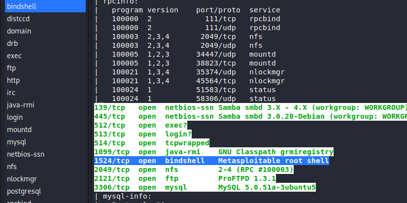

- Simple command using netcat : nc -nv 192.168.157.131 1524 would
  already give us full control over the victim machine and as root shell
  that what makes it critical.

  - 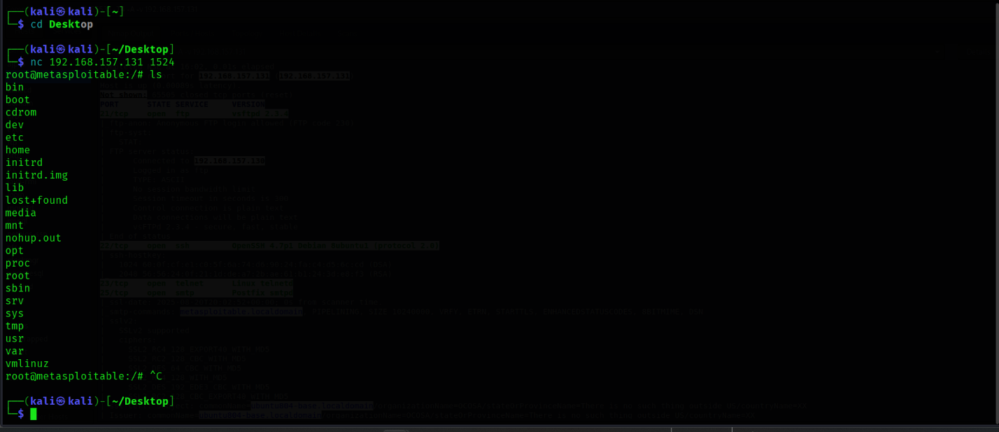

  - So after we just launched that command we were as we said, root.

  - Now we just wanted to play a bit so we did read the two main loot
    files shadow, passwd:

    - 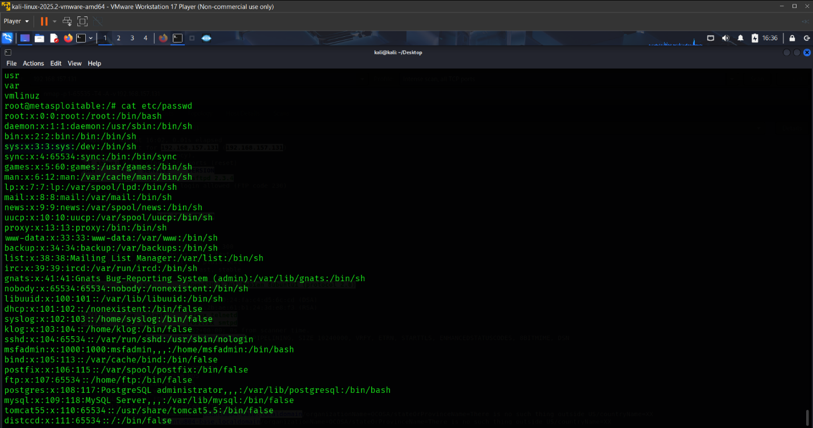

    - 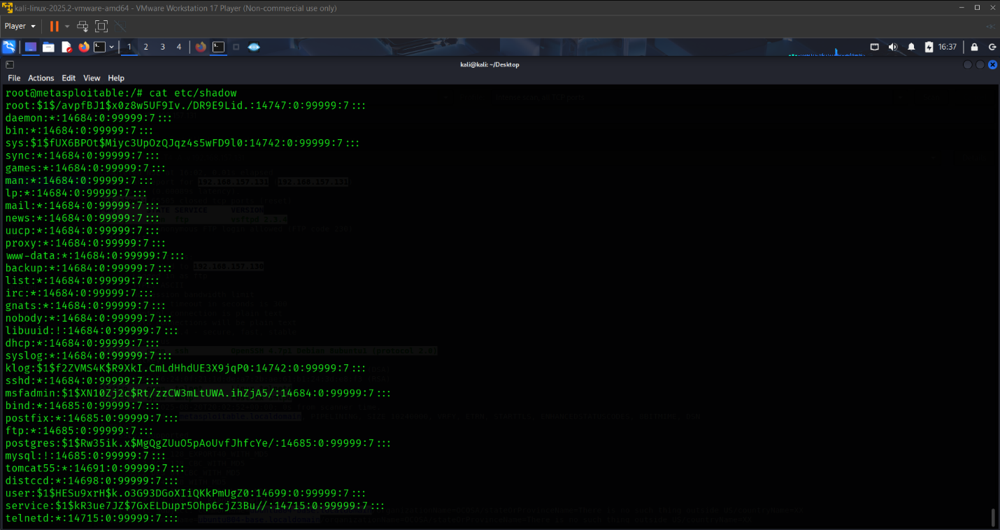

- But this vulnerability wasn’t enough to satisfy us, so check the
  upcoming Hacked vulnerability and see all the spices down there.

**Remediation:**

1.  **Immediate Containment:** Immediately terminate the process
    listening on port 1524. This can be done by identifying the Process
    ID (PID) using a command like netstat -tulnp \| grep :1524 or lsof
    -i :1524 and then killing it with kill -9 \<PID\>.

2.  **Eradication:** Permanently remove the mechanism that starts this
    service. On Metasploitable, this is typically launched
    by inetd or xinetd. Investigate the configuration files
    (/etc/inetd.conf, /etc/xinetd.d/) for an entry related to port 1524
    and remove it.

3.  **Investigation:** Treat this with the highest severity. A bindshell
    is almost always a indicator of a prior compromise. A full forensic
    investigation is required to determine how this backdoor was
    installed (e.g., which other vulnerability was exploited first) to
    prevent re-infection.

4.  **Recovery & Hardening:** After removal, reboot the system and
    verify that the port is no longer open. Harden the system by
    removing unnecessary services, applying security patches, and
    implementing strict firewall rules.

5.  **Monitoring:** Implement robust monitoring and Intrusion Detection
    System (IDS) rules to alert on any subsequent attempts to open
    unauthorized network listeners or reinstate the backdoor.

**2-Vulnerability Name:** <u>DistCC Daemon Unauthenticated Command
Execution</u>

**CVE Reference:**
[CVE-2004-2687](https://nvd.nist.gov/vuln/detail/CVE-2004-2687)

**CVSS Score**: 9.8 (Critical) -
CVSS:3.0/AV:N/AC:L/PR:N/UI:N/S:U/C:H/I:H/A:H

**Severity: High**

**Description:** The DistCC service (distributed compiler) version v1
((GNU) 4.2.4) is running without authentication controls on port
3632/tcp. This critical misconfiguration allows a remote,
unauthenticated attacker to execute arbitrary operating system commands
on the target system by sending specially crafted compilation requests.

**Impact:** a complete compromise of the system's integrity,
confidentiality, and availability:

- Initial Foothold: An attacker can gain a remote command shell on the
  vulnerable system.

- Privilege Escalation: The service runs under the daemon user account.
  Combined with other system misconfigurations (e.g., SUID binaries),
  this access can be leveraged to gain full administrative (root)
  control of the host.

- Pivot Point: A compromised system can be used to launch further
  attacks against other, more critical systems within the same network
  segment.

**Evidence of the vulnerability:**

- First we’ve highlighted our open port and service available on it.(and
  yes we’ve used zenmap for the Gui privilege because of the loads of
  ports we wanted everything to be kinda organized.)

  - 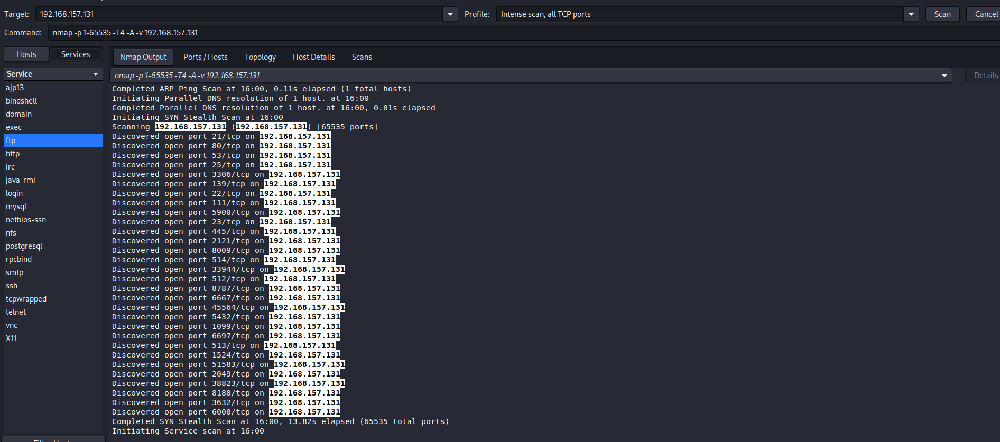

  - 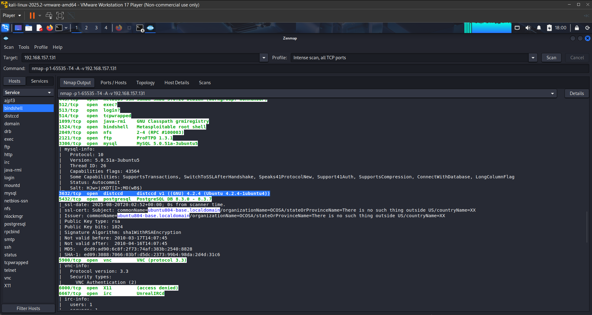

- So afterwards we used search command of metasploit to search across
  the database for a matching module to use:

  - 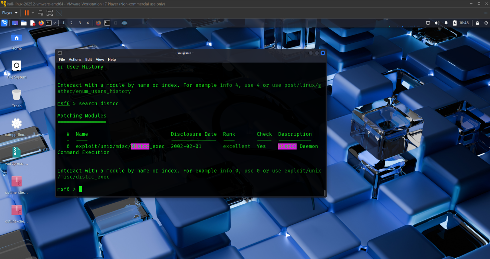

  - Found that module: exploit/unix/misc/distcc_exec

- Were going to use the default payload but failed so switched to the
  reverse pearl payload and after we used it, it WORKED !!!!!:

  - Explanation: The exploit tricked the DistCC service into running a
    command it shouldn't. Instead of a compilation command, we sent a
    command to execute our payload (a small piece of code that gives you
    a shell).

  - 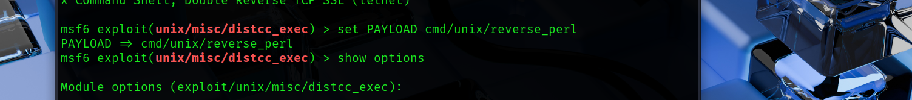

  - 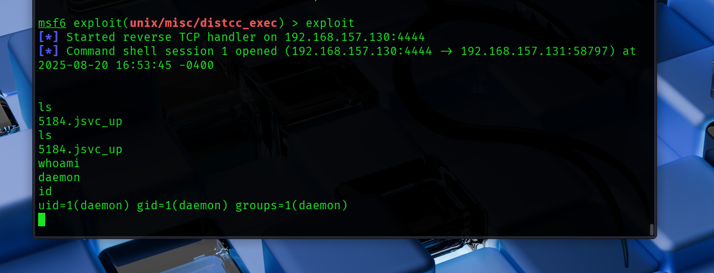

  - Hurray were on the system gained a command shell on victim machine
    now with user daemon.

- Although we can already view the /etc/passwd file with the user we
  managed to initialize which is daemon we wanted to spice it up a bit.

  - 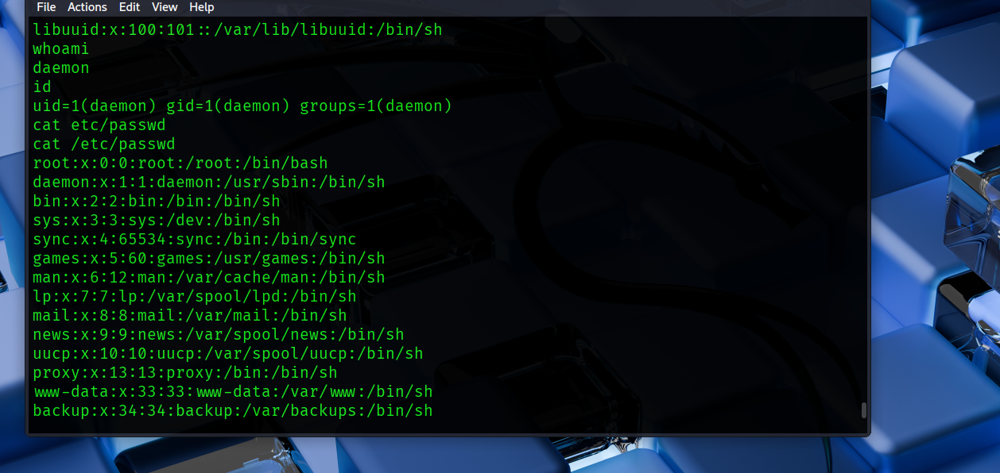

  - Same for /etc/shadow

  - 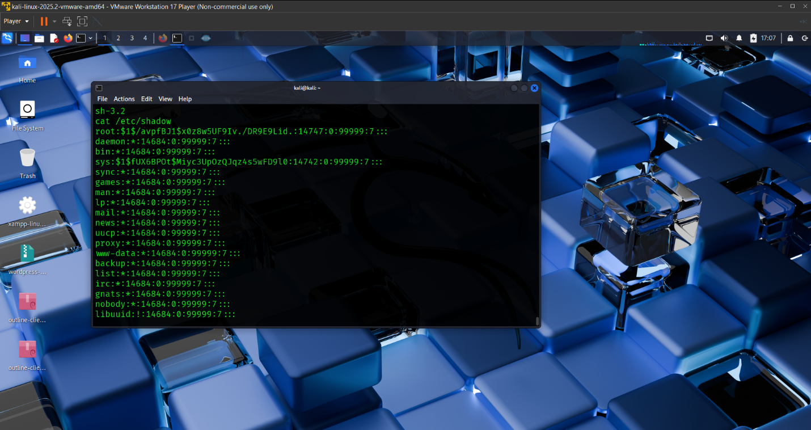

  - But as we said let’s spice it up.

- We tried to gain privilege escalation on the system and we got it
  using simple privilege escalation techniques:

  - Now first let’s explain what we did here:

  - Concept: What is SUID?

    - On Linux, every file has permissions: Read, Write, and Execute for
      the file's Owner, Group, and Others.

    - There's a special permission called the Set User ID (SUID) bit.

    - How it works: If an executable file has the SUID bit set, it will
      always run with the privileges of the file's owner, not the user
      who executed it.

    - Example: If the nmap program is owned by root and has the SUID bit
      set, when daemon runs it, it will run as root.

  - And that is exactly what we did, from our daemon shell we ran a
    command: find / -perm -u=s -type f 2\>/dev/null

    - this command hunts for SUID files.

    - 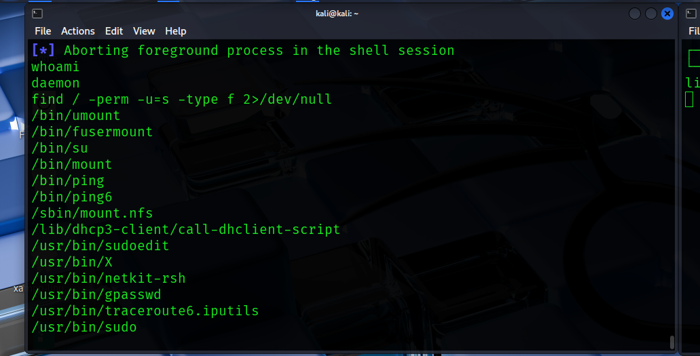

    - We’ve seen /usr/bin/nmap that path was our ticket to root.

    - 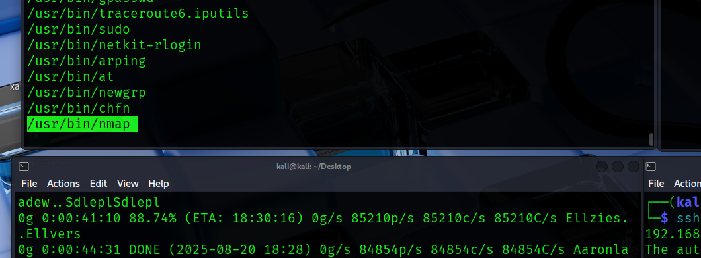

    - Very old versions of nmap (like 2.02 to 5.21) had an interactive
      mode. This was intended for expert users to write scripts and test
      things.

    - Crucially, this interactive mode allowed us to escape to the
      system shell using the !sh command.

    - Since nmap was running with root privileges (SUID), the escaped
      shell would also be root.

    - Ran : /usr/bin/nmap –interactive to start the nmap scripting.

    - 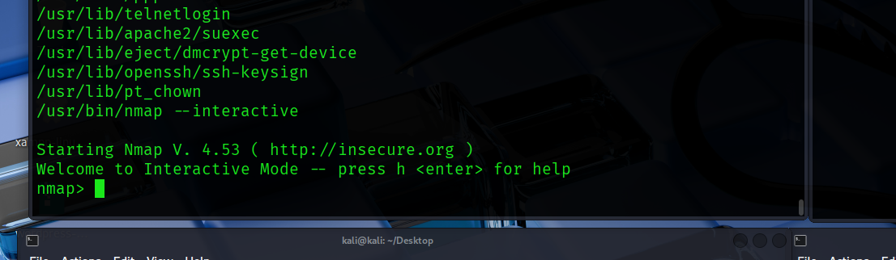

    - Now ran the : !sh which tells the nmap to run the sh on the
      operating system cause of the !

    - 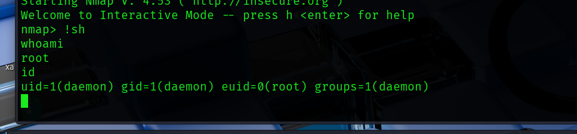

    - Hurray again!!, root privilege escalated successfully.

    - 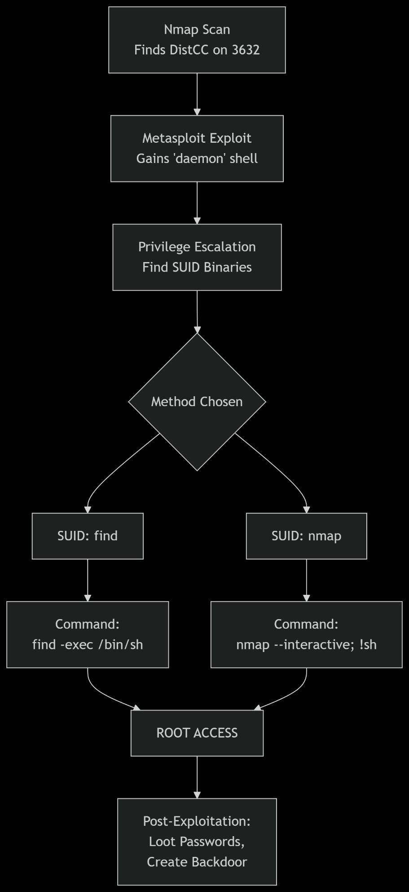

- Also tried to spice things up more and more with creating a backdoor!,
  and here comes netcat.

- 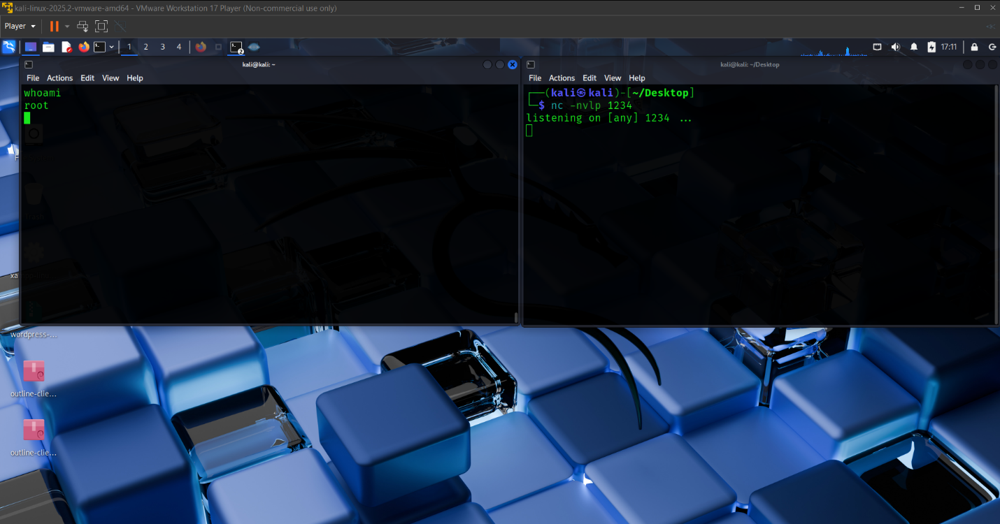

- Intitialized a netcat listener on another terminal.

- 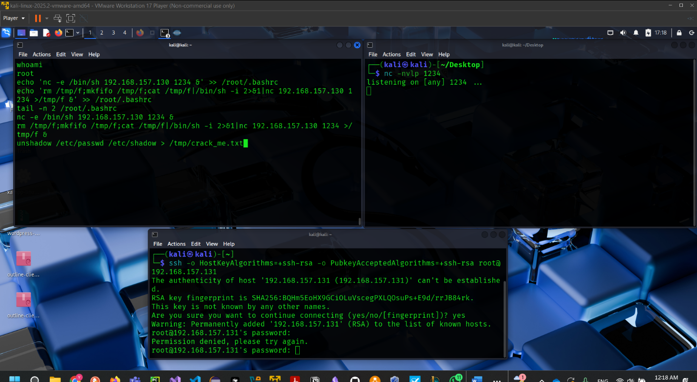

- And that was the most basic way to create a back door using netcat but
  ofcourse we would’ve needed the root password which we managed to get
  it’s hash but tbh honest it was already too late to crack the password
  with John the ripper so we only got satisfied to that point.

- 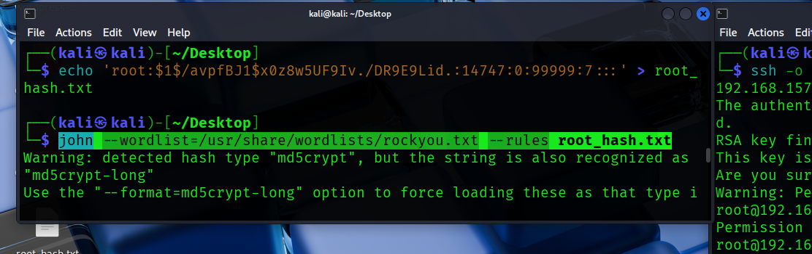

- And that was our journey with metasploitable 2 machine.

**Remediation:**

1.  **Immediate Mitigation:** Immediately disable the DistCC service if
    it is not explicitly required for a business function. This can be
    done by stopping the associated service (e.g., sudo
    /etc/init.d/distcc stop) or removing it from
    the inetd/xinetd configuration.

2.  **Network Access Controls:** If the service is absolutely necessary,
    implement strict network firewall rules to restrict access to the
    DistCC port (3632/TCP) only from explicitly authorized, trusted
    compilation clients. It must not be accessible from untrusted
    networks like the internet.

3.  **Software Upgrade:** The current version of DistCC is end-of-life
    and contains known vulnerabilities. Upgrade the environment to a
    supported, patched version of the software that requires
    authentication.

4.  **Principle of Least Privilege:** Ensure the service runs under a
    dedicated, non-privileged user account (not root) to limit the
    potential impact of a compromise. (Note: The service on
    Metasploitable already runs as daemon, which is correct).

5.  **Vulnerability Assessment:** Implement a regular vulnerability
    scanning regimen to identify and remediate outdated and insecure
    services before they can be exploited.

**IOCS:**

- Hash of password root:
  \$1\$/avpfBJ1\$x0z8w5UF9Iv./DR9E9Lid.:14747:0:99999:7:::

- IP of victim: 192.168.157.131

- Port: 3623
