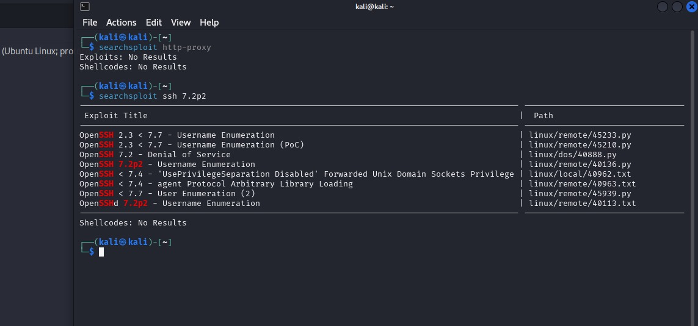

Professional training Project

Youssef Mahmoud Elsaeed

Okay first of all let’s discuss the scenario from the pdf:

We are a pentest company, Hired to perform a test on Saturn’s internal
network and recommend appropriate mitigation solutions.

Target: Saturn Security Ltd

We’ll divide that report into 3 split sections: First one is setup,
Phases 2 & 3 will be Reconnaissance (info Gather) and Exploitation.

**<u>Setup Phase:</u>**

1.  Did the setup for the Saturn series of target machines.

2.  Ran all three of them.

3.  Configured our attacker kali machine to be on the same network with
    our target machines to perform our testing.

4.  Now for the Testing phase, First the INFO GATHER.

**<u>Phase 1: Reconnaissance</u>**

Tools Used:

- ZenMap

- SearchSploit

- Nist Website (For the CVE’S)

1-Host Discovery: Using ZenMap (Findings + Steps)

- First we’ve applied the host discovery technique after we’ve
  initialized our target setup to check for our target machines in the
  target network with zenmap which is the GUI for nmap.

- Command: nmap -sP 192.168.56.0/24

- Explanation of the command Scan the whole subnet from .1 to .254.

- The Results and our Main Target Machines IPS, Mac Addresses in the
  screenshot:

  - 192.168.56.100

  - 192.168.56.101

  - 192.168.56.105

  - 192.168.56.106

- Screenshot:

2-Port Scanning For each Host: Using ZenMap (Findings)

- Okay now for the port scanning with our tool to find open ports,
  service versions, and os for each host to know what we’ll exploit in
  those hosts.

- Command: nmap -sS -sV 192.168.56.X

- Explanation of the command it’s a stealth scan(syn scan) to find the
  open ports, service name, version number.

- Screenshot for each
  host:

- Result Conclusion: found open ports on hosts .101, .103 and the
  interesting result was the opened port 8080 on the host ending in .103
  which gives the key opening to the website.

3-Identified Vulnerable Services: (Findings)

- Now let’s go into our upcoming task which is identifying the
  vulnerable services and our point of view of those vulnerabilities
  explaining why with some CVE’s.

- As we’ve said the two hosts with some open ports and services which
  might be vulnerabilities is our .101, .103 so let’s discuss each hosts
  vulnerabilities.

- .101
  :
  Okay let’s talk about some of them and first one is the most dangerous
  which is the ftp service on port 21 because it causes a denial of
  service due to limited number of connections allowed
  <https://nvd.nist.gov/vuln/detail/CVE-2021-30047> This is the CVE for
  that vulnerability and in the next steps we’ll provide some
  screenshots of the details we’ve conducted for most of the
  vulnerabilities on each service for that host using searchsploit.
  
  this one is for the CVE we’ve talked about on the version
  provided.This
  one is on the smtp service on port
  25.This
  is for the apache server version which is crucial on port
  80.

- .103 :
  
  Here we can talk about the service ssh on port 22 our searchsploit
  results
  The
  openssh has many cve’s but
  [CVE-2016-0777](https://nvd.nist.gov/vuln/detail/cve-2016-0777),
  [CVE-2016-3115](https://nvd.nist.gov/vuln/detail/cve-2016-3115) is the
  most remarkable.

- Now we’d finished Phase 1 which is collecting information and doing a
  well performed automated and manual processes of reconnaissance for
  our target to get an idea about exploiting it.

So let’s dive in to the next phase which is the exploitation.

**<u>Phase 2: Exploitation</u>**

Tools Used:

- MetaSploit

- Enum4linux

- Smbclient

- Hydra

- Ncrack

- BurpSuite

-Exploit a Vulnerability to get into the network:(Steps)

- The main goal here is to get access using a found vulnerability from
  the services that we did find earlier in order to gain a privilege of
  entering this private network to be able to gain our wanted files.

- We’ve tried at the beginning of our exploitation phase loads of
  options including exploiting the vsftpd 3.03, apache server and many
  many trials using metasploitable but ofcourse we did fail because that
  wasn’t the case.

- So first we need to Choose a vulnerability  and
  as the guidance said that the company does have some non compliance to
  the policies of password’s combinations and creation, also as our
  GRC(TA) advised to be going for the pursuit of cracking into the
  internal network through the os user’s login so we’ll proceed with it.

- First input we needed is the organization’s Usernames on the target
  machine and we’ve tried tools like enum4linux and some smbclient
  testing to know the users of the up host with port 22 to build an ssh
  connection and get the usernames list but we couldn’t get any.

- So we’ve gone through another option which was so much easier we used
  the website on the host with open http proxy service on port 8080 to
  access the website and managed to find a list of 11 users emails on
  that
  website:
  So we did create our list of usernames that we’ll try to crack through
  the os with using the usernames in the email addressees without the
  domain name
  ofcourse.

- So now we’ll go to the next step which is conducting our second input
  which is the password list and we did have it included already.

- So now the Final step which is the exploitation(Cracking of the
  passwords) to get into the network and we did so by:

  - Using first hydra as our main cracking tool but it wouldn’t be
    working out for us because of the really big password list we
    had:

  - So we’ve decided to use ncrack to make use of the parallel sessions
    to speed up
    things:

  - Splitted the usernames into two .txt one with 5 and other with 6
    usernames and initialized two parallel cracking sessions.

  - Also a remarkable notice, in parallel with the ncrack bruteforcing
    we were brute forcing the web too with Burp using the two inputs
    usernames as emails and password using the word list too as noted in
    the pdf some of the users didn’t do with the policy of changing the
    password in each one of both so we were doing bruteforcing on both
    the os and the webservice.

  - we did intercept the login request sent the request to intruder,
    added to payloads because we were going to use the clusterbomb
    attack which is trying each set of usernames with all the passwords,
    and it’s used when we’ve got two lists as our case and we don’t know
    which goes for
    which:and
    now we’re waiting for any result of any of both.

  - After waiting for 3 hours we’ve got nothing from ncrack and the
    remaining was approx 4 more hours so we’ve realized that we need
    only one authorized to get the flags maybe we don’t need all of them
    and also to decrease some time we’ve launched the same command but
    with only one user processed at a time and to decrease the steps of
    searching more than one we’ve launched 6 parallel ncrack brute
    forces terminals to make use of ncrack and why 6? Because our
    Hardware couldn’t be handling
    more:

  - 5 more of these on each user.

  - Command: ncrack -u username -P passwordlist.txt -p \<portnumber\>
    \<Ipaddress\>

  - Okay we did fail again, looks like we we’re targeting the wrong ip
    (target machine) all that bruteforcing time so we’ve deleted
    everything, configured it back again, and here we go.

  - Did our host scanning and finally found our wanted target
    .102:

  - We’ll not do the same mistake again we needed to make sure that it’s
    the machine we are targeting with the ssh version 5.9
    too:

  - Also we did use enum4linux to make sure of the usernames are listed
    on that os, make sure that the fileserver is on that ip and to make
    sure that it allows
    sessions:Hurrraaaay!!!!
    found our users on that server then we did confirm everything we
    needed.

  - So now we can start from where we started to crack that machine but
    for notice our Burp scan got us two email addresses passwords and
    we’ve tested them on site in the last configuration and it was
    right, we even thought it would be our last hope to use evolution to
    set up a mail server and view the emails but we wanted to try one
    last time to crack the os password so here we go.

  - First we’ll see if one of those two users didn’t follow the IT
    management advice of not using the same password in both the website
    and os.

  - Well obaidat, pgraf isn’t the using the same password so we did run
    our ncrack as expected.

  - Found pgraf user password FINALLYYYY and now to the ssh login.

  - We did an ssh login with that user and
    password:

  - Success finally now we’re on the system and after doing some
    searching we did conclude that all of the users in home is actually
    empty except only three users pgraf, dietrich, jpesci now we are
    still searching all the network not just those
    users:

  - But we’ve decided to move all those directories to our kali in case
    anything goes wrong we would search them maybe the flags is obvious
    but we didn’t notice
    yet:

  - Made a directory in our machine called Saturn_dumb copied the whole
    home directory in case there is hidden files although we did ls -la
    to show if there is hidden files but we did use all the directory to
    ease up the
    process:

  - Now we have the home of Saturn in our own directory and still
    searching for those flags.

  - Maybe those flags is on the emails at last and that’s another
    scenario but we wont speed up things.

  - Surprisingly first thing found was the accounts confidentials file
    and it was found using the find command searching for pdfs on the
    machine:Then
    found an interesting
    path:which
    is the .vault a hidden one so gone to investigate it: and after we
    did copy it on our kali opened it through our main host operating
    system using shared folders between both we managed to opened the
    pdf:So
    this is a flag.

  - We still got 3 more flags to go but we’ve got so lost with those
    files because the flags required in the pdf is unnamed and that is a
    problem.

  - We found another one which is either the financial history statement
    or the confidential business plan but we don’t know which one is it,
    side note we did our research on the system pretty well to search
    for FROST & SULLIVAN name on any type of files and there was nothing
    there
    so:

  - Our search now went only to the users that we concluded they aren’t
    empty
    

  - Although we got lost a bit but there was a file in the .vault with
    the extension .meo which made us curious about it so we did a
    research to find out about it and known that it’s an encryption
    extension for sensitive files so ofcourse we got curious to see
    what’s inside:
    **<u>Saturn_SDB.meo</u>**

  - It did ask for a password and because we’ve found it in bidietrich
    user we are pretty sure it’s the password for it but we don’t have
    time to get it.

  - We also did try a hex and text editor to tryna open
    it:but
    also no hope.

  - So we conclusion for that file it’s expected and we are kinda sure
    it’s the SafeDepositBox which is the 20 marks flag but we don’t have
    more time to get it but we are sure it’s because of the research
    we’d done so now we do have 3 flags out of 4.

- Finally ended the exploitation phase safely, conclusion for the
  company’s safety we need to perform maybe one more pentesting session,
  Risk assessment for the whole company and some awareness for the
  company’s workers because they lack a lot but in general it was a
  great journey and thank you for reading this report.

-Brute forcing section: (Findings)

Email:

- User: a.obaidat@saturn.com, Pass: canada150

- User: p.graf@saturn.com, Pass: aceshigh

OS:

- User: pgraf, Pass: showmethemoney
