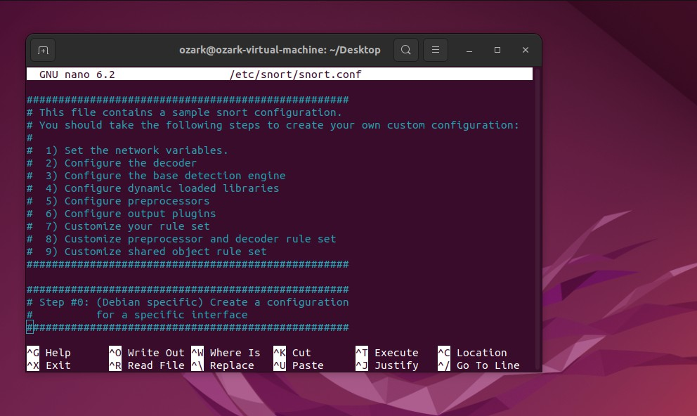

🐷

SNORT(IDS & IPS)

# What is snort?

Snort is an open source intrusion detection and prevention system which
was created in 1998 by Martin Roesch. Martin Roesch founded Sourcefire
in 2001 which was acquired by Cisco in 2013. The company is now
developed by Cisco.

# Rules:

>  Snort rules consist of two parts
> which are Rule Header and Rule Options.
>
>  Rule header contains the **Ruleʼs
> Action, Protocol, Source IP Address, Source Port, Direction,
> Destination IP Address and Destination Port** information.
>
>  **Rule options form the heart of
> Snortʼs intrusion detection engine combining ease of use with power
> and flexibility**. All Snort Rule Options are seperated from each
> other using semicolon(;). Rule option keywords are separated from
> their arguments with a colon(:).
>
> 
> Rule:

# Installation guide:

1.  sudo apt-get update

2.  sudo apt-get install snort -y

3.  prompt ur interface and ip range (pop up appears)

4.  Configuration file of snot -\> /etc/snort/snort.conf

-Commented any rule that was already up to test our own rules in
local.rules file.

5.  if you wanna use it as
    host based ids or ips then change the HOME_NET field value to your
    ip addr.

6.  Now editted our local.rules file in /etc/snort/rules/local.rules

7.  added two rules one for icmp protocol (PING) and one to detect ssh
    connection attempts.

8.  Now pinged from our
    attacker machine to test our config

9.  resulted the past which is our icmp detection rule, it worked!!
