CTI Project

(MISP)

Youssef Mahmoud Elsaeed

First of all, in order to be able to dive into the task itself, we need
first to identify the tools used, and some definitions.

What is [MISP Platform](https://www.youtube.com/watch?v=lCN4n8CNkNM):

> Short term for: Malware Information Sharing Platform & Threat Sharing.

- MISP is an open-source threat intelligence platform used to collect,
  store, and share cybersecurity threat information, such as indicators
  of compromise (IOCs), threat actor data, and malware attributes. It
  helps organizations collaborate and automate threat intelligence
  processes.

What is an APT:

Short term for: Advanced Persistent Threat.

- An APT refers to a prolonged, targeted cyberattack in which an
  intruder gains access to a network and remains undetected for an
  extended period. APTs are typically carried out by well-resourced,
  organized groups (often nation-state or criminal syndicates) with
  specific objectives like espionage or data theft.

What is APT Group Data:

> This refers to structured information about a specific APT
> group---such as APT28 or Lazarus---including:

- Known indicators (IPs, domains, hashes)

- Tools, techniques, and procedures (TTPs)

- Campaign details

- Attribution data

- Publicly available reports and feeds

What is Tags in MISP:

> Tags are labels you can assign to events or attributes in MISP to
> categorize, filter, and search for related intelligence. Examples:

- apt28

- phishing

- malware:ransomware

- Custom tags like internal-review-needed

What is Events in MISP:

An Event in MISP is the primary container for threat intelligence data.
Think of it as a \"case file\" or \"incident report\" that groups
related pieces of intelligence together.

What is Attributes in MISP:

An Attribute is an individual data point within an Event. These are the
actual indicators and contextual information that make up the threat
intelligence.

What is [APT 28](https://attack.mitre.org/groups/G0007/):

This is a threat group that has been attributed to Russia\'s General
Staff Main Intelligence Directorate (GRU) 85th Main Special Service
Center (GTsSS) military unit 26165. This group has been active since at
least 2004.

They reportedly compromised the Hillary Clinton campaign, the Democratic
National Committee, and the Democratic Congressional Campaign Committee
in 2016 in an attempt to interfere with the U.S. presidential election.

Campaigns ID: [C0051](https://attack.mitre.org/campaigns/C0051)

Some of the Techniques IDS:

- [T1134](https://attack.mitre.org/techniques/T1134/)

- [T1098](https://attack.mitre.org/techniques/T1098)

- [T1583](https://attack.mitre.org/techniques/T1583)

Now we may be getting the task started, let's dive into MISP
installation first:

- First we need to install MISP via docker.

- Cloned the repo of MISP from GITHUB into our machine

  - {width="6.5in"
    height="0.9708333333333333in"}

- Navigated the directory of MISP.

- Now as we researched it, we needed to create a configuration file for
  us to be able to configure our localhost as a base url:

  - We've created a .env file as a copy of the template.env file in
    order for us to be able to come back if we missed it up.

    - 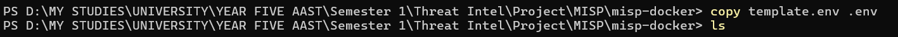{width="6.5in" height="0.275in"}

  - Now we're going to edit the .env file in order to change the baseurl
    value:

    - {width="3.3336220472440945in"
      height="1.4334580052493437in"}

- Now to launching MISP phase, we're going to use docker compose up -d
  now:

  - 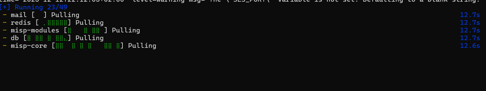{width="6.5in"
    height="1.2270833333333333in"}

  - Now docker is initializing the instance, creating the container and
    the -d used in the command is for the detached mode meaning running
    it in the background.

  - 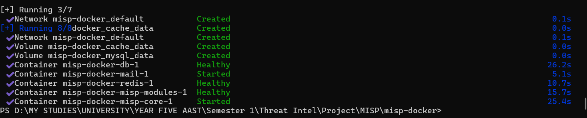{width="6.5in"
    height="1.3111111111111111in"}

  - After MISP did finish creating the container now we could start
    checking it.

  - Now accessing localhost on port 443 the default for https we'll find
    our MISP successfully initialized:

  - {width="6.5in"
    height="3.2395833333333335in"}

- Now to the second phase adding the APT group data and we've chosen APT
  28 as a trial group data.

- First we'll need to create an event which is our CASE model.

- Created an event with those values:

  - {width="6.5in"
    height="3.026388888888889in"}

- Now we've created an empty event, we'll dive deeper now and fill our
  Data, by adding attributes which is our indicators.

  - {width="5.3087937445319335in"
    height="6.542233158355206in"}

  - Added two network activity IOCs found on some public feed.

  - 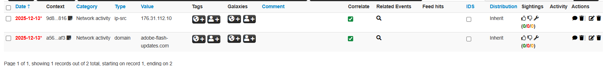{width="6.5in"
    height="0.7194444444444444in"}

  - Also added some more IOCs after getting how the game works.

    - 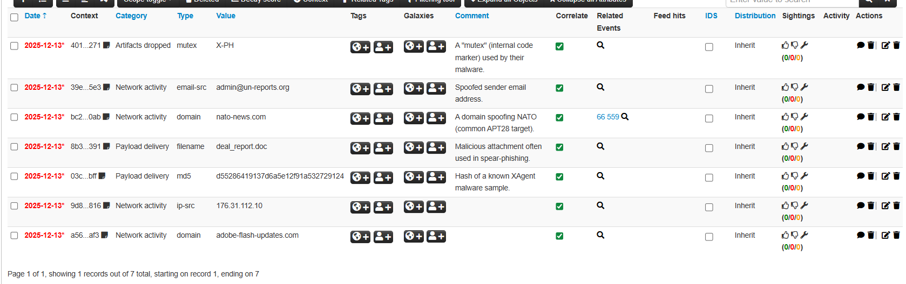{width="6.5in"
      height="2.045138888888889in"}

- Now into another phase which is enabling feeds, activating two of
  default feeds of OSINT on MISP (CIRCL, botvrij)

  - {width="6.5in"
    height="0.9458333333333333in"}

  - Enabled those feeds, and fetched the data.

  - Now ive enabled some more sources like (malwarebazar, URLhaus, etc)

  - .

  - Now to check if fetching those data and events did work, I did go to
    the administration bar and navigated to jobs for making sure, and it
    was correctly being loaded:

    - {width="6.5in"
      height="2.7569444444444446in"}

- Now to adding the tags, and I've managed to add 4 tags, navigated to
  the add tag in events section up.

  - {width="5.917179571303587in"
    height="4.567062554680665in"}

  - Now added the tags to the event, 3 as global and one as local to
    learn difference in context.

  - {width="6.5in"
    height="1.757638888888889in"}

  - 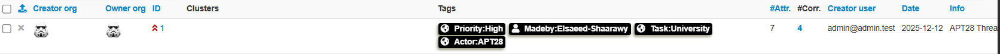{width="6.5in"
    height="0.35347222222222224in"}

- Now to the script phase, but before we parse and unify we'll first use
  a script to show stats of the db. Which is line 14

  - 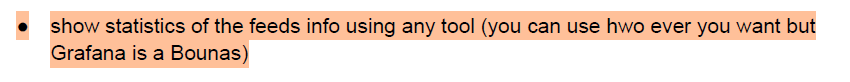{width="6.5in"
    height="0.6270833333333333in"}

- After writing a script to first get some stats from db.

  - {width="6.5in"
    height="3.3673611111111112in"}

- First we did compose down the docker image, then we went to the
  docker.yaml configuration file to expose the database port and added a
  line ports: then specified port numbers to be able to access the db
  using that port using our script.

- Faced some challenges after but, did compose up the image and now we
  had our db running on the specified port:

  - 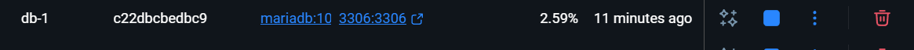{width="6.5in" height="0.3625in"}

- Now to the second challenge in order to access the database we need
  it's credentials and due to some technical errors we'd face we needed
  to check for the credentials docker already used because they aren't
  written in the .env file.

  - {width="6.5in"
    height="0.8791666666666667in"}

- After getting our credentials now edited our script with the
  credentials in the screenshot up there, yes I took it after I wrote
  this line down so go check it up there.

- Now let's run our script and till now I hadn't checked if it will work
  I only checked another script for mockup data and it did so now for
  the real script.

- YAAAAY! It did work:

  - 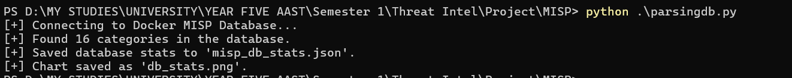{width="6.5in" height="0.64375in"}

- Let's check the results

  - It creates a json file with the stats:

    - {width="6.5in"
      height="5.582638888888889in"}

  - And creates a simple statistical diagram

    - 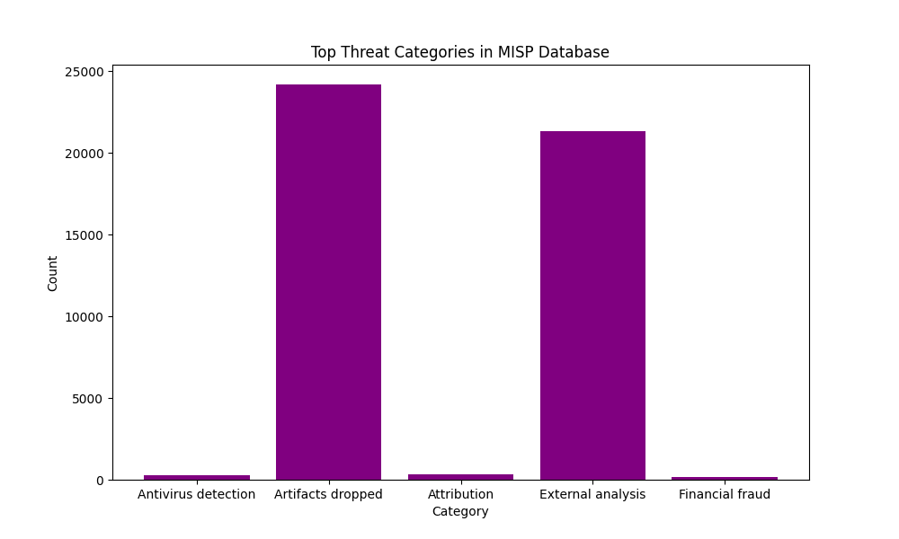{width="6.5in" height="3.9in"}

- But it's not the unifying script, don't get confused this script was
  for just accessing the db and checking the stats.

- And this was task 14 which is show stats using any tool and here we
  did use python script.

- Now to our parsing and unifying script:

  - {width="6.5in"
    height="4.446527777777778in"}

  - {width="6.5in"
    height="3.247916666666667in"}

  - It is designed to show ioc, type, source, and severity of that feed.

- I've used digitalside and urlhaus for this task to get some feeds and
  unify them into json.

  - Now running the script: {width="6.5in"
    height="1.0944444444444446in"}

- Now to the json created:

  - {width="6.5in" height="3.8in"}

  - It showed ioc, type, source, and severity of that feed.

- It was also designed to show a png stats of how many feeds got from
  sources:

  - {width="6.5in"
    height="4.0625in"}

- Now that we had finished our required task, we can go to some bonus
  knowledge.

- The email alert rule for any new or updated events.

- We'll need to navigate to administration then server settings then
  MISP tab.

  - 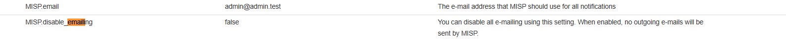{width="6.5in"
    height="0.33611111111111114in"}

  - First make sure that our dummy mail that we'll receive notifications
    on is written correctly in our case it's <admin@admin.test>.

  - Make sure the disable_emailing is set to false.

  - 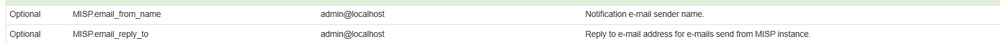{width="6.5in"
    height="0.28402777777777777in"}

  - Now we'll edit both values with a dummy email: admin@localhost
    should've been an smtp server but it's a proof of concept for now.

- Now we did check the box of any event that is published (new or
  updated get me a notification on my email signed in the previous step
  which is dummy for now.

  - {width="4.067018810148731in"
    height="0.6000524934383202in"}

- Now we've finished task 15 the bonus of an email alert rule for events
  published.

- Now to the Grafana task bonus

- First we'd used that command to download and launch Grafana instance
  on the same internal network MISP's database uses for it to be able to
  connect with the db of MISP, and specified port 3000:

  - \<docker run -d \--name=grafana-bonus -p 3000:3000
    \--network=misp-docker_default grafana/Grafana\>

  - 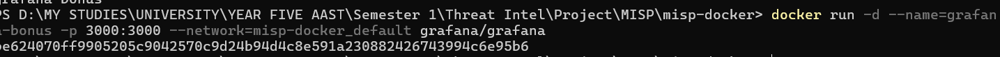{width="6.5in"
    height="0.37569444444444444in"}

  - Navigated to our localhost port 3000

  - Logged in with defu credentials.

  - {width="6.5in"
    height="3.3875in"}

- Grafana is up and we're there.

- Now let's roll to the connection with MISP's db.

- Navigated to connections \> datasources \> addnewdatasource.

- Chosen mysql and filled our details for the db of MISP:

  - {width="6.5in"
    height="3.4270833333333335in"}

  - {width="6.5in"
    height="1.13125in"}

  - Connected successfully to the MISP db.

- Now to the creating a new dashboard from the top right corner of
  Grafana.

- Changed the query editor into code instead of builder and wrote this
  simple sql query for the stats of IOCs, specially the category value
  of the attribute:

  - {width="6.5in"
    height="1.4166666666666667in"}

  - And here we go our query as a bar chart:

    - {width="6.5in"
      height="2.102777777777778in"}

  - Now as a table

    - {width="6.5in"
      height="2.0590277777777777in"}

  - Now let's try changing the query into more detailed more
    sophisticated one showing metric and value:

    - {width="5.59215113735783in"
      height="1.5584678477690288in"}

    - Here's the bar chart vertical of it:

{width="6.5in"
height="3.688888888888889in"}

- Now we've finished our project, initializing a massive threat intel
  platform like MISP was a great training for any SOC trainee.

- Thank you for reading.
