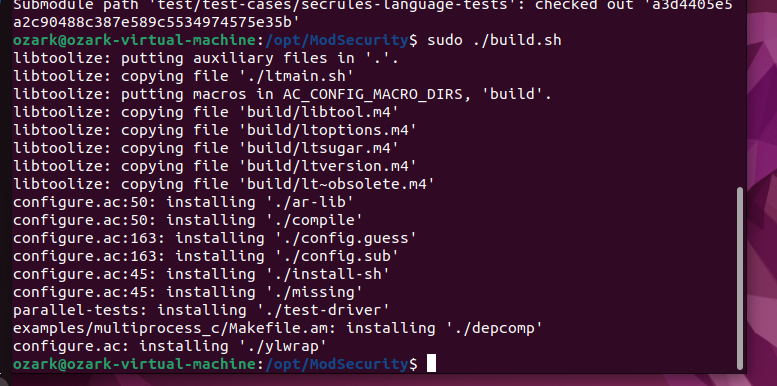

NGINX DOCUMENTATION

Youssef Mahmoud Elsaeed

Information about NGINX:

- is an HTTP web server, reverse proxy, content cache, load balancer,
  TCP/UDP proxy server, and mail proxy server.

What is WAF(web application firewall):

- is a security tool specifically designed to protect web applications.
  It operates at the application layer (Layer 7 of the OSI model). Its
  job is to inspect, filter, and block malicious HTTP/HTTPS
  traffic *before* it reaches your web application(so it can clean the
  traffic from malicious payloads in a request or whatever).

- WAF looks for and protects against attacks like:

  - SQL Injection (SQLi): Where an attacker tries to execute malicious
    database commands.

  - Cross-Site Scripting (XSS): Where an attacker tries to inject
    malicious scripts into web pages viewed by other users.

  - Local/Remote File Inclusion (LFI/RFI): Where an attacker tries to
    trick the application into exposing or running files on the server.

  - Cross-Site Request Forgery (CSRF): And many other OWASP Top 10
    vulnerabilities.

So let’s discuss the relation and integration between both:

- Nginx itself is not a WAF. However, its modular and extensible
  architecture allows you to integrate a WAF directly into it. This is
  the most common and powerful way they are used together.

- ModSecurity is the WAF that integrates with Nginx.

How does they work together:

- Request sent, a user's web browser sends an HTTP request to your
  website. This request goes to your server, where Nginx is listening.

- Nginx receives the request. Because the WAF (ModSecurity) is
  integrated as a module, Nginx passes the entire request—headers, body,
  and all—to the ModSecurity engine for inspection before deciding what
  to do with it.

- ModSecurity scrutinizes the request against its rule set (e.g., the
  OWASP Core Rule Set). It asks: "Does this look like a SQL injection?"
  "Is this a known malicious user agent?" "Is this an attempt to access
  a sensitive file?"

- IF request is clean:

  - ModSecurity gives it the all-clear. Nginx then proceeds with its
    normal job—serving the static file or passing the request to the
    PHP, Python, Node.js, etc., application in the backend.

- Else (request is malicious or contains a payload of any kind that
  matches the ruleset):

  - ModSecurity tells Nginx to block it. Nginx then immediately stops
    processing and returns a 403 Forbidden error to the user's browser.
    The malicious request never even touches your vulnerable web
    application.

- And finally the logging:

  - Both Nginx and ModSecurity log the event. The Nginx error log will
    show that a request was denied, and the ModSecurity audit log
    (modsec_audit.log) will contain incredibly detailed information
    about why it was blocked, which specific rule was triggered, and the
    exact part of the request that was malicious.

Information about ModSecurity:

- is primarily a rule-based (or signature-based) WAF, not one that
  relies primarily on behavioral analysis or heuristics.

-  ModSecurity's core operational model. It works by checking every
  incoming request against a giant list of predefined patterns (rules)
  that are known to be malicious.

- But while researching foung out that modsecurity contained a part that
  could be considered heuristics: OWASP CRS which contains anomaly
  scoring system.

ASSIGNMENT:

- Required:

  - install nginx, modsecurity.

  - Setup and configure.(WAF)

- Deliverables:

  - Report with every single step setup step.

  - Screen shot of the website before and after the web attack.

  - screenshot of attack on the website <http://localhost/?attackxss>
    without waf, and with waf and identify the usage of NGINX.

So let’s roll in to our setup of both NGINX with modsecurity 3:

- Okay first of all the basic update and upgrade to check for all
  packages and libraries for modsecurity 3 that we need would be there
  and we are right on track:

  - \<sudo apt update && sudo apt upgrade\>

  - \<sudo apt install gcc make build-essential autoconf automake
    libtool libcurl4-openssl-dev liblua5.3-dev libfuzzy-dev ssdeep
    gettext pkg-config libgeoip-dev libyajl-dev doxygen libpcre++-dev
    libpcre2-16-0 libpcre2-dev libpcre2-posix3 zlib1g zlib1g-dev -y\>

- Then went to modsecurity installation in the /opt directory:

  - \<sudo git clone
    https://github.com/owasp-modsecurity/ModSecurity.git\>

  - 

  - 

- Then let’s build to complete installation:

  - \<sudo ./build.sh\>

  - \<sudo ./configure\>

  - 

  - 

  - \<sudo make\>

  - \<sudo make install\>

  - 

  - 

- Now we’ve completed the installation of modsecurity 3 from source but
  we are missing it’s connectors so let’s install it in the /opt
  directory:

  - \<sudo git clone
    <https://github.com/owasp-modsecurity/ModSecurity-nginx.git>\>

  - 

- Now to our web server (NGINX) 1.28 installation, important note: the
  ppa:ondrej branch follows latest NGINX Stable packages compiled
  against latest OpenSSL for HTTP/2 and TLS 1.3 support:

  - 

  - \<sudo apt install nginx -y\>

  - 

- According to the documentation nginx is enabled using systemctl
  command:

  - 

  - Checked the status of nginx, active well done!

- Now let’s download the source code of nginx of our intended version
  1.28:

  - \<Sudo wget <https://nginx.org/download/nginx-1.28.0.tar.gz>\>

  - 

  - Extracted the file

- Now we need to build nginx with module on modsecurity that we
  successfully installed above.

  - So let’s run the config script in our source directory:

  - \<sudo ./configure --with-compat
    --add-dynamic-module=/opt/ModSecurity-nginx\>

  - 

  - \<Sudo make\>

  - \<Sudo make modules\>

- Now let’s copy the modsecurity modules to nginx modules-enabled, also
  copy configuration of modsecurity and Unicode:

  - \<sudo cp objs/ngx_http_modsecurity_module.so
    /etc/nginx/modules-enabled/\>

  - \<sudo cp /opt/ModSecurity/modsecurity.conf-recommended
    /etc/nginx/modsecurity.conf\>

  - \<sudo cp /opt/ModSecurity/unicode.mapping
    /etc/nginx/unicode.mapping\>

  - And made sure it’s done:

  - 

- Now we need to enable modsecurity in the nginx.conf file so let’s edit
  it to load the modsec module:

  - load_module
    /etc/nginx/modules-enabled/ngx_http_modsecurity_module.so;

  - Loaded this line into the configuration file of nginx

    - 

  - also need to modify the server block to activate modsecurity:

    - \<sudo nano /etc/nginx/sites-enabled/default\>

    - Then add those lines:

    - 

  - And, edit /etc/nginx/modsecurity.conf to change SecRuleEngine to On:

    - \<sudo nano /etc/nginx/modsecurity.conf\>

    - 

    - Change the SecRuleEngine field to On instead of DetectionOnly.

- Now we’ve walked many steps so let’s check with -t and we need to
  restart nginx server.

  - \<sudo nginx -t\>

    - 

  - \<sudo systemctl restart nginx\>

    - 

- Finally, we can test the nginx server with browser on its public ip
  address.

  - 

- Remember the Core Rule Set (CRS) we talked about earlier in the
  information about ModSecurity section?

  - This is our next step is to add those (CRS) and if we remember well:

    - ModSecurity scrutinizes the request against its rule set (e.g.,
      the OWASP Core Rule Set). It asks: "Does this look like a SQL
      injection?" "Is this a known malicious user agent?" "Is this an
      attempt to access a sensitive file?"

  - Also side note: owasp crs could give modsecurity heuristic nature
    cause of the anomaly scoring system.

  - Let’s add that rule set:

  - We need firstly to download core rule set from owasp, owasp crs
    provide rule to check if the client request has malicious code or
    not.

  - We will download owasp crs to nginx configuration directory:

    - \< sudo git clone https://github.com/coreruleset/coreruleset.git
      /etc/nginx/owasp-crs\>

    - 

  - Then we copied the configuration:

    - \< sudo cp /etc/nginx/owasp-crs/crs-setup.conf{.example,}\>

  - Then we need to update our modsecurity configuration to load owasp
    crs:

    - Opened /etc/nginx/modsecurity.conf

    - 

    - Added two lines to load owasp crs configuration.

  - Restarted nginx again

- Now finally for the final result, our test of NGINX + modsecurity on
  our web browser:

  - 

  - Now let’s try some shell code and see the results:

    - 

  - Okay testing logs:

    - 

    - Looks like it’s working pretty well.

    - 

    - Working well, saw the anomaly score we’ve talked about earlier?

    - Request parameter is our shell code and the host is our targeted
      web server too, so PERFECT.

  - One more check, let’s turn modsecurity off from the
    /etc/nginx/sites-enabled/default

    - 

    - 

    - 

  - Now we are sure that our modsecurity was working just fine and
    perfect.

- Now after we’ve successfully deployed NGINX web server, Installed
  ModSecurity (WAF) to our web server, configured and adder the OWASP
  (CRS) we’ve managed to successfully acquire new skills and learn more
  about how WAFs works, what is the configuration files and how can we
  deal with it, what is NGINX web server and why it’s widely used.

During research found installation documentation but this time with a
super easier guide because we’ll download the module integrated from the
beginning:

- [Installation
  Documentation](https://docs.nginx.com/nginx-waf/admin-guide/nginx-plus-modsecurity-waf-installation-logging/)

- Check it out

Refrences:

- [Splitted Installation
  Documentation](https://dev.to/henri_sekeladi/install-nginx-with-modsecurity-3-owasp-crs-on-ubuntu-2204-5d6l)

- [One module Installation
  Documentation](https://docs.nginx.com/nginx-waf/admin-guide/nginx-plus-modsecurity-waf-installation-logging/)

- [Configuration
  Documentation](https://nginx.org/en/docs/configure.html)
