ELK Stack

(Elastic + Kibana only)

<u>Installation & Setup</u>

Name: Youssef Mahmoud Elsaeed

Let’s first talk about ELK:

What is ELK (siem solution):

A platform, software used for converting raw logs into something that is
parsed, well combined, structured and ease up things for socs(socs
weapon number one).

The logs is signing of the system about a certain event that confirms
that it happened or not, and set’s somebody to be accountable for that
action.

ELK consists of 3 main modules which integrates together to form our
siem solution.

ELK nature compared to others: Distributed systems, Harder deployment.

Why ELK:

- Open Source

- Low Cost

- Advanced Search Capabilities

**Components:**

- ElasticSearch

- Logstash

- Kibana

**Roles:**

- **ElasticSearch: a database.**

  - Data Storage: Stores logs and structured data collected by agents.

  - Search Performance

- **LogStash: a heavy weight log shipper.**

  - Data collection

  - Data processing: parsing logs into structured JSON and enrich logs
    with fields.

  - Data Forwarding: to elasticsearch(db)

- **Kibana: the Siem Visualization.**

  - Data visualization: the UI

  - Dashboards: control panel that shows important info in one place.

  - Alerting and monitoring: integrates elasticsearch’s alerting
    features, enabling users to set up notifications based on specific
    conditions.

In our installation we’ll use only the siem & search engine(db):

- Elastic search

- Kibana

- We’ll also use light weight agents for log shipping:

  - Beats

    - File Beat

    - Winlog Beat

So, Let’s roll to our Installation Guide:

- First things first we’ll use the formal documentation on ELK website
  installing Elastic first with a Debian package:

- So we’ve made sure first that we have the GPG key:

  - 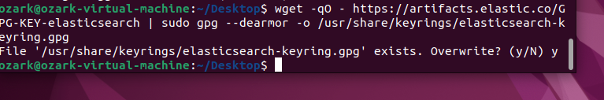

  - Overwritten to make sure.

  - The resulting elasticsearch-keyring.gpg will serve as the signing
    key for apt.

- Then we intalled the needed apt-transport-https package:

  - 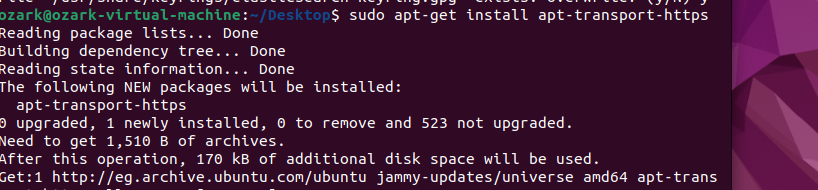

  - Saved the repository definition
    to /etc/apt/sources.list.d/elastic-9.x.list

  - 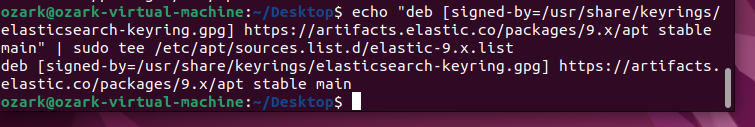

- Now to the Elastic installation:

  - 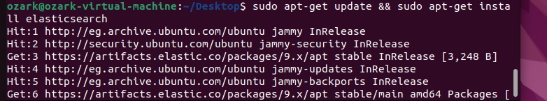

- Elasticsearch has three configuration files:

  - elasticsearch.yml for configuring Elasticsearch

  - jvm.options for configuring Elasticsearch [JVM
    settings](https://www.elastic.co/docs/reference/elasticsearch/jvm-settings)

  - log4j2.properties for configuring [Elasticsearch
    logging](https://www.elastic.co/docs/deploy-manage/monitor/logging-configuration/elasticsearch-log4j-configuration-self-managed)

  - For our config we want to configure elasticsearch itself main
    settings so we’ll only need .yml file:

  - So now let’s go to the configuration file:

  - Sudo nano /etc/elasticsearch/elasticsearch.yml

    - 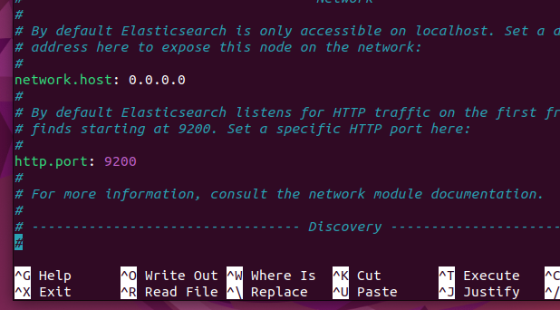

    - Network.host: 0.0.0.0 -\> to listen on all interfaces.

    - 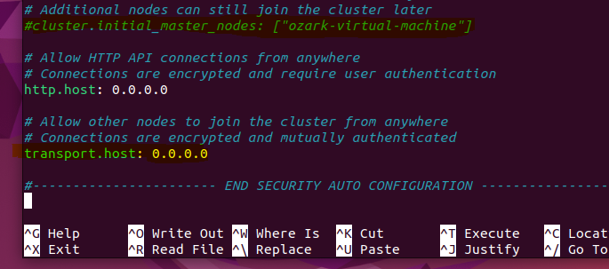

    - Commented cluster.initial because we’re not gonna use it.

      - Update!!!: uncommented that line It didn’t work and after
        research understanded that elastic cannot run without an initial
        cluster, in a single-node mode.

    - Uncommented transport.host.

      - the line #transport.host: The 0.0.0.0 setting enables
        Elasticsearch to listen for connections on all available network
        interfaces.

    - Saved the configuration file.

  - So now let’s start elastic and check the status:

    - \<sudo systemctl start elasticsearch.service\>

    - 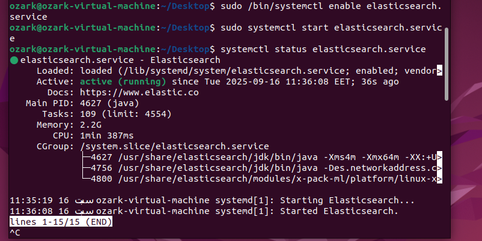

  - Okay now we’re going to set our new password to be able to check and
    be clear with elastic search:

    - Used the following command:

    - \<sudo /usr/share/elasticsearch/bin/elasticsearch-reset-password
      -u username\>

    - 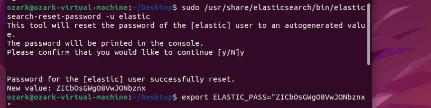

  - Now that elasticsearch supposed to be runnin then let’s go check
    from our web browser after logging with the default username and our
    generated new password:

    - 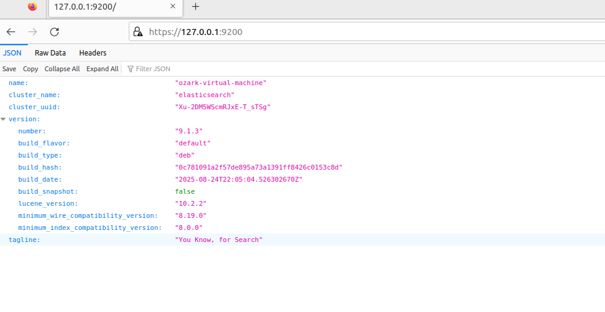

  - Okay great now that we’ve confirmed that elastic is running all good
    let’s roll to kibana.

  - Side not had many trials with kibana and after many and many trials
    decided to purge it and restart ( half an hour gone)

    - 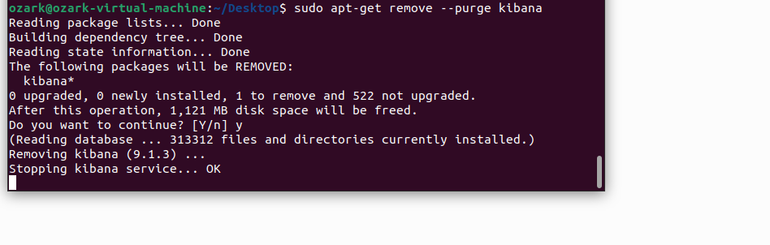

  - Decided to save everything in a text file to not get distracted
    again.(I’ll explain later that enrollement key)

    - 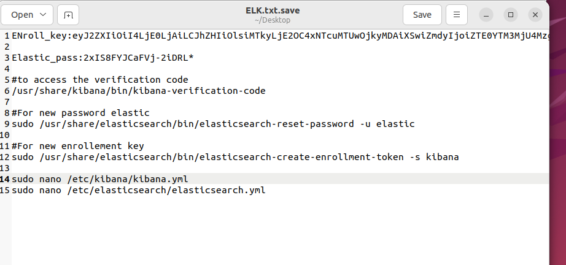

  - Let’s start our download:

    - 

    - Installing kibana following the elk website documentation.

  - Rolled to the configuration file of kibana in /etc/kibana/kibana.yml
    to adjust two variables:

    - 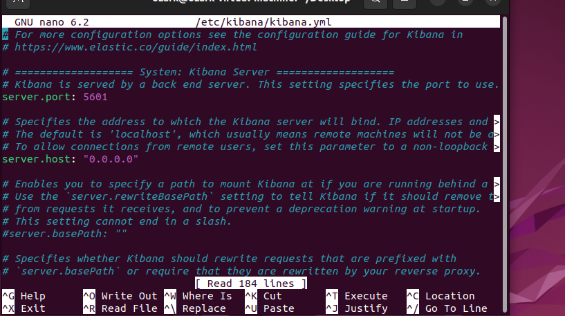

    - Server.host: the 0.0.0.0 is as we said to make it accessible to
      all interfaces I think we’ve got familiar with it by now.

    - And uncommented the server.port: 5601 which is the default port
      for kibana.

    - !!discovered that the first time I had a problem with kibana
      because I did uncomment another line which was the setting the
      localhost of elastic which made problem with the setup of kibana
      because we did give 0.0.0.0 to both hosts of kibana and elastic so
      when I did uncomment that line kibana froze.

  - Now let’s start and check the status of kibana:

    - 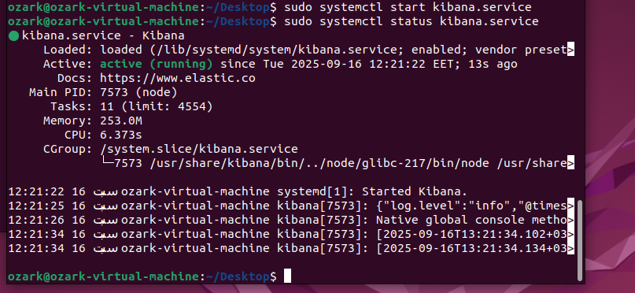

  - Okay all set up, gone to our web browser checked our localhost:5601
    and kibana requested an enrollment key:

    - \<sudo
      /usr/share/elasticsearch/bin/elasticsearch-create-enrollment-token
      -s kibana\>

    - The past command according to the documentation runs the script
      that generates the enrollement key for us.

      - 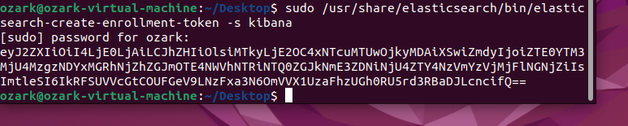

    - Saved that key to our txt file up there.

  - Pasted that key into the webpage that requested it:

    - 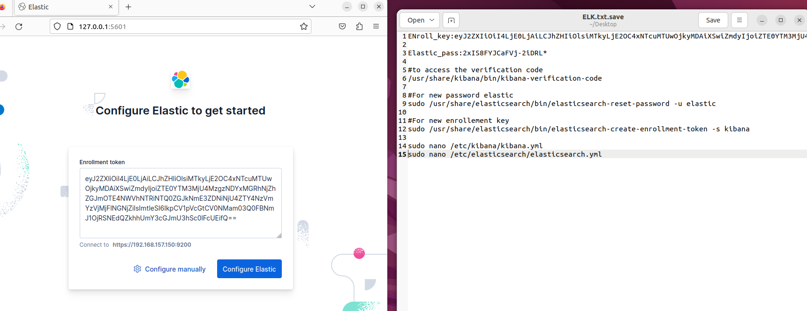

    - The site wanted the verification code and I did find it by
      surprise in my \<systemctl status kibana\> terminal.(although it
      was mentioned in the documentation)

      - 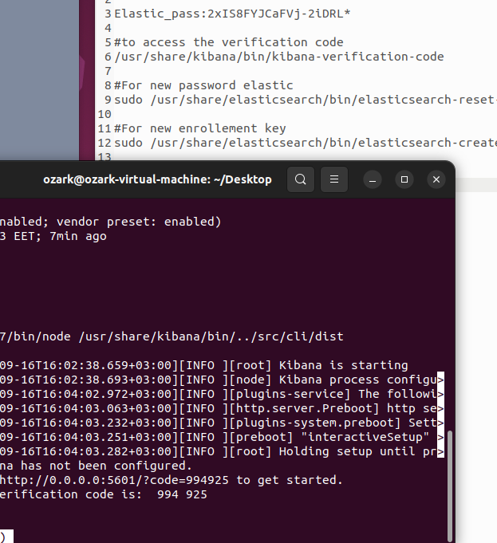

  - Waited for a bit then a login page appeared:

    - Elastic search username

    - Elastic search password

    - 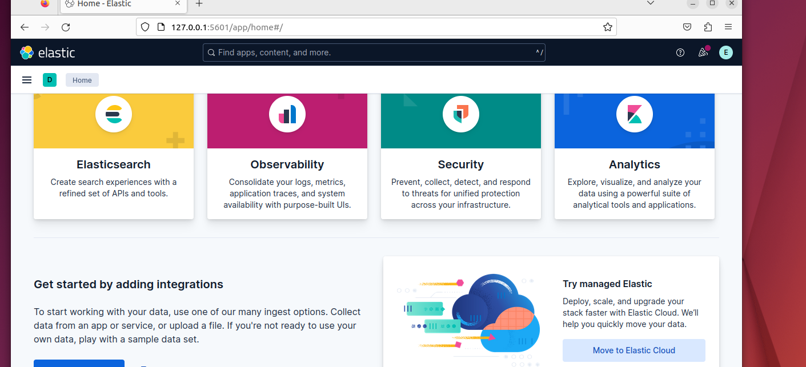

    - And finalyyyy our kibana is done(side note: I purged the whole
      elastic stack once more for the second time because something was
      wrong with my whole virtualmachine it could’nt handle elastic as I
      didn’t provide enough resources)

  - Now let’s install our lightweight agent filebeat:(Logshipper)

    - In order to deliver logs to kibana our visualization we need to
      deliver logs to elastic and in order to do so we need a log
      shipper.

    - So let’s install it first:

    - 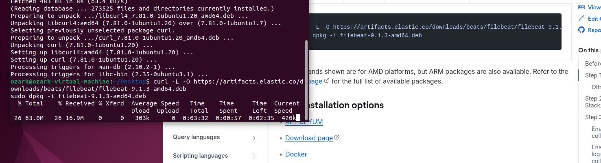

  - Let’s now roll to the configuration of it in
    /etc/filebeat/filebeat.yml:

    - 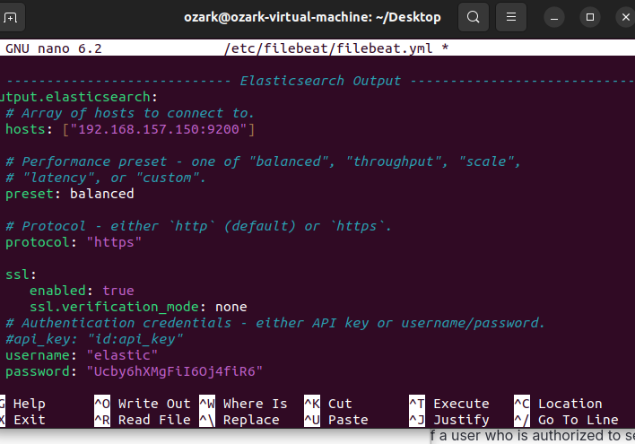

    - Followed the site’s documentation and my personal notes from the
      session.

    - Saved the file and exited.

  - After testing the configuration and finishing it’s setup now to
    kibana to view results.

    - 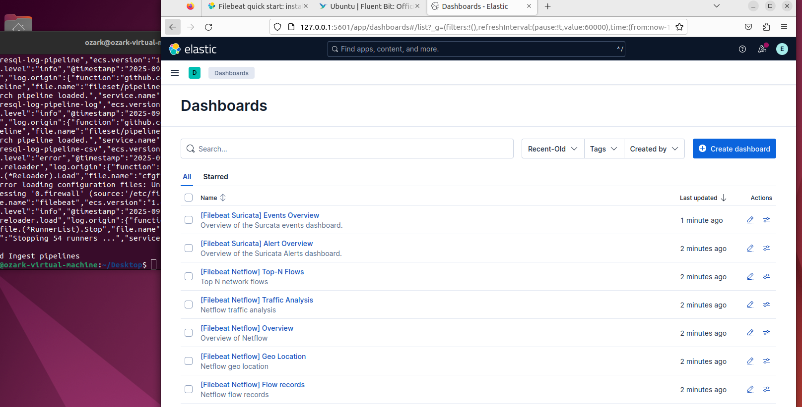

    - Oh greattt, finally we’ve got a full siem system that we can
      partially use.

- Now our task is done, and we’ve learnt many lessons through that task
  which was all about soc engineering and how to install ELK stack
  (without logstash).

References:

- [Elastic
  documentation](https://www.elastic.co/docs/deploy-manage/deploy/self-managed/installing-elasticsearch)
  (Configuration is covered in other directories there)

- [ElasticSearch
  installation](https://www.elastic.co/docs/deploy-manage/deploy/self-managed/install-elasticsearch-with-debian-package)

- [Kibana
  installation](https://www.elastic.co/docs/deploy-manage/deploy/self-managed/install-kibana)
