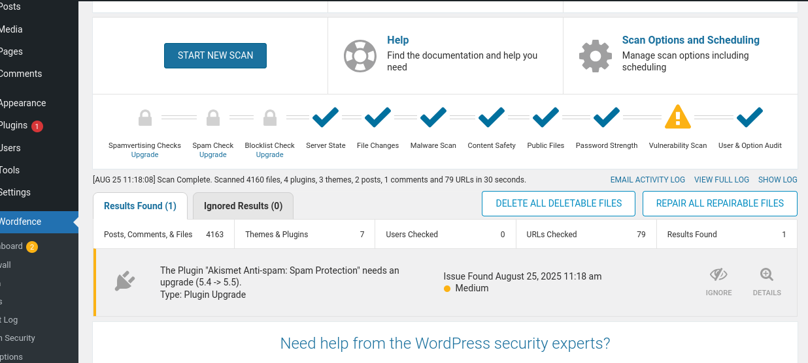

Task 1 NTI: Wpscan, Wordfence

Wordpress hardening

Youssef Mahmoud Elsaeed

Let’s write down the required tasks first:

- Scan your wordpress with wpscan and document vulnerabilities.

- Install and configure wordfence with appropriate security settings.

- Apply atleast 3 hardenning measures from the session.

  - File permissions.

  - Wpconfig.php hardening.

  - .htaccess security rules.

  - Login protection.

  - Database prefix change.

- Create a short report documenting

  - Initial vulnerabilities.

  - Security measure implemented.

  - Before/after security posture

  - Recommendations for further protection.

So let’s Dive in the first task which is The wordpress scan:

- So first thing we did install wpscan tool which is a tool used to scan
  for wordpress vulnerabilities.

- Second we ran the scan with the simple command: wpscan -url
  <http://localhost/wordpress> --random-user-agent and we needed the
  last – random useragent flag to give access to the wp scan to go
  through the wordpress as a normal user and look what we found:

  - 

  - Yes the flag isn’t in the screen shot but we needed it eventually.

  - 

  - 

  - So first task done and let’s conclude the initial vulnerabilities.

- Now with the second step which is wordfence configuration.

- First configuration was to the firewall which we did press the
  optimize button which enables the learning mode which is essential.

  - 

- Second we went to the wordfence scan tab which we dealt with the scans
  which we did set it to standard plan and ran our first scan to check
  posture.

  - 

  - 

  - Looks like there is an anti spam plugin that we need to upgrade and
    we did and then scanned again.

  - 

  - Now we are all set up to next step

- We did set our admins email address in the alloptions tab email alerts
  to get notified if anything happened.

  - 

  - Did set the settings of the email alerts to needed and crucial yes
    options.

  - 

- Then went to login security tab to set the options we need the most
  which is 2fa and captcha

  - Set the settings right
    

  - Now 2fa roles is set.

- Then set the bruteforce settings section to our rules

  - 

- Now we’ve conducted all we needed to do on wordfence and now let’s
  move on to the next step.

- First file permissions change

- Now after we’ve gone to our wordpress file directory we opened
  terminal and ran:

- Set all directories to 755:

  - (read+execute+write for owner, read+execute for group and others)

  - find . -type d -exec chmod 755 {} \\

- Set all files to 644:

  - (read+write for owner, read for group and others)

  - find . -type f -exec chmod 644 {} \\

- Made wp-config.php extra secure (600):

  - (read+write for owner only, no access for group and others). This is
    crucial as it contains your database password.

  - chmod 600 wp-config.php

- The web server (e.g., Apache user www-data) needs to be able to write
  here to upload media

  - Which is the uploads directory

  - chmod 755 wp-content/uploads

- Now to the wpconfig.php file hardening.

- Located and Backed Up the wp-config.php file in the WordPress root
  directory (/var/www/wordpress/).

- Generated and Applied new, unique authentication keys and salts from
  the official WordPress API to invalidate any existing sessions and
  strengthen cryptographic security.

- Added Security Directives:

  - define('WP_POST_REVISIONS', 5); to limit database post revisions,
    preventing unnecessary database bloat.

  - define('DISALLOW_FILE_EDIT', true); to disable the built-in theme
    and plugin editor within the WordPress admin dashboard. This is a
    critical measure that prevents attackers from modifying PHP code
    even if they compromise an admin account.

- Now to the .htaccess hardening.

- Implemented the following rules:

  - Blocked XML-RPC: Added a rule to deny all access to the xmlrpc.php
    file, mitigating pingback attacks and brute force amplification
    attempts.

  - Protected wp-config.php: Implemented a rule to deny web access to
    the wp-config.php file, preventing attackers from directly
    downloading this file containing database credentials and secret
    keys.

  - Disabled Directory Browsing: Added the Options -Indexes directive to
    prevent attackers from easily listing the contents of directories
    that lack an index.php or index.html file.

  - Prevented Image Hotlinking: Configured mod_rewrite rules to only
    allow images to be served if the request originates from the lab
    site's own domain (127.0.0.1), protecting bandwidth and content.

- Now we are finished.

<u>Initial vulnerabilities:</u>

1. **Server Information Exposure** (Medium Risk)

- **Details**: The scan revealed detailed server information:

  - Server: Apache/2.4.58 (Unix)

  - PHP Version: 8.2.12

  - Additional modules: OpenSSL/1.1.1w, mod_perl/2.0.12, Perl/v5.34.1

- **Risk**: Exposing specific version information helps attackers
  identify potential vulnerabilities to exploit

- **Found By**: Headers (Passive Detection)

- **Confidence**: 100%

2. **XML-RPC Enabled** (High Risk)

- **Details**: XML-RPC interface is accessible
  at <http://127.0.0.1/wordpress/xmlrpc.php>

- **Risk**: XML-RPC can be exploited for:

  - Pingback attacks (DDoS amplification)

  - Brute force attacks

  - Authentication bypass attempts

- **References**: Multiple Rapid7 exploitation modules exist for this
  vulnerability

- **Found By**: Direct Access (Aggressive Detection)

- **Confidence**: 100%

3. **Readme File Exposure** (Low Risk)

- **Details**: WordPress readme.html file is publicly accessible

- **Risk**: Reveals exact WordPress version to potential attackers

- **Found By**: Direct Access (Aggressive Detection)

- **Confidence**: 100%

4. **Directory Listing Enabled** (Medium Risk)

- **Details**: Upload directory has listing enabled
  at <http://127.0.0.1/wordpress/wp-content/uploads/>

- **Risk**: Allows attackers to browse and potentially access uploaded
  files

- **Found By**: Direct Access (Aggressive Detection)

- **Confidence**: 100%

5. **External WP-Cron Enabled** (Low-Medium Risk)

- **Details**: External WP-Cron system is accessible

- **Risk**: Can be exploited for Denial of Service (DoS) attacks by
  overloading the cron system

- **Found By**: Direct Access (Aggressive Detection)

- **Confidence**: 60%

6. **WordPress Version Detection** (Informational)

- **Details**: WordPress version 6.8.2 identified (released July 15,
  2025)

- **Status**: This appears to be the latest version, which is positive

- **Detection Methods**:

  - Emoji settings (Passive Detection)

  - Meta Generator (Passive Detection)

7. **No Plugins Detected** (Positive Finding)

- **Details**: No plugins were found during enumeration

- **Implication**: Reduces attack surface as plugins are common
  vulnerability vectors

8. **No Configuration Backups Found** (Positive Finding)

- **Details**: No vulnerable config backup files were discovered

- **Implication**: Prevents attackers from accessing sensitive
  configuration data

<u>Security measure implemented:</u>

1.  **Optimized the Firewall**, which is running in Learning Mode.

2.  **Scheduled daily scans** to proactively look for threats.

3.  **Downloaded needed plugins.**

4.  **Set up email alerts** to be notified of any security events.

5.  **Hardened your login page** with reCAPTCHA and started setting up
    2FA.

6.  **Configured brute-force protection** to automatically lock out
    attackers.

7.  **File System & Server-Level Hardening**

- Applied secure file permissions across the entire WordPress
  installation:

  - Set all directories to 755.

  - Set all files to 644.

  - Restricted access to the critical wp-config.php file to 600.

- Hardened the wp-config.php file by:

  - Generating and implementing new, unique authentication keys and
    salts.

  - Disabling the built-in theme/plugin editor (DISALLOW_FILE_EDIT).

  - Limiting post revisions (WP_POST_REVISIONS) to reduce database
    bloat.

- Enhanced the .htaccess file with Apache security rules to:

  - Block all access to the xmlrpc.php file.

  - Deny web access to the wp-config.php file.

  - Disable directory browsing across the entire site (Options
    -Indexes).

  - Prevent image hotlinking to conserve bandwidth.

**8. Security Through Obscurity (Optional)**

- Installed and configured the "WPS Hide Login" plugin to change the
  default WordPress login URL (/wp-admin) to a custom, hidden slug,
  effectively stopping all automated bots that target the default login
  page.

<u>Before/after security posture:</u>

- Security posture before:

  - Overall Risk Level: Medium

  - The most critical issues to address are:

    - XML-RPC endpoint exposure (High Risk)

    - Directory listing in uploads folder (Medium Risk)

    - Server information disclosure (Medium Risk)

- Security posture after:

  - The security posture has been elevated to Low-Risk. The implemented
    measures have systematically addressed the identified
    vulnerabilities:

  - Critical Services Secured: The XML-RPC endpoint has been completely
    disabled at the server level, eliminating a major attack vector.

  - Information Disclosure Mitigated: Server signatures are now hidden,
    directory listing is disabled, and critical files (wp-config.php,
    readme.html) are no longer accessible via the web.

  - Attack Surface Reduced: The admin file editor is disabled, strong
    authentication keys are in place, and login attempts are now
    rate-limited and protected by 2FA.

  - Proactive Defense Established: A web application firewall (WPScan)
    is now active with tailored rules, and daily scans are in place to
    detect future threats.

<u>Recommendations for further protection:</u>

1.  **Implement a Web Application Firewall (WAF):** Consider a
    cloud-based WAF service (such as Cloudflare or Sucuri) to filter and
    monitor HTTP traffic before it even reaches your server. This can
    help mitigate large-scale DDoS attacks and OWASP Top 10
    vulnerabilities.

2.  **Enforce HTTPS Everywhere:** Ensure SSL/TLS is properly configured
    and force all traffic to use HTTPS. This can be done by adding a
    redirect rule in the .htaccess file and
    setting define('FORCE_SSL_ADMIN', true); in wp-config.php to encrypt
    all admin activity.

3.  **Implement Continuous Monitoring:** Use a security plugin that
    offers real-time file integrity monitoring and malware detection.
    Wordfence Premium offers this feature, which can alert you
    immediately if any core, theme, or plugin file is altered without
    your knowledge.

4.  **Establish a Formal Backup and Recovery Strategy:** Automate
    regular, off-site backups of both your website files and database.
    Ensure you have tested the restoration process so you can quickly
    recover your site in the event of a severe security incident. The
    3-2-1 rule is recommended (3 copies, on 2 different media, 1
    off-site).

5.  **Adhere to a Strict Update Policy:** Formalize a process to review
    and apply updates for WordPress core, all plugins, and themes within
    a 48-hour window of their release. This is the single most effective
    defense against known vulnerabilities.

6.  **Advanced User Hardening:**

    - **Principle of Least Privilege:** Audit user accounts and ensure
      each user has only the permissions absolutely necessary to perform
      their role. Remove outdated or unused user accounts.

    - **Password Policy:** Enforce strong password requirements for all
      users.

7.  **Database Hardening:** Change the database user permissions to only
    allow SELECT, INSERT, UPDATE, and DELETE on the WordPress database,
    and revoke permissions like DROP or ALTER to prevent schema
    modification in case of a breach.

8.  **Server-Level Hardening (Advanced):**

    - **Isolate Processes:** Run PHP-FPM under a dedicated user per
      site.

    - **Configure Security Headers:** Add headers
      like Strict-Transport-Security (HSTS), X-Content-Type-Options,
      and Content-Security-Policy (CSP) in the web server configuration
      for an additional layer of client-side protection.
