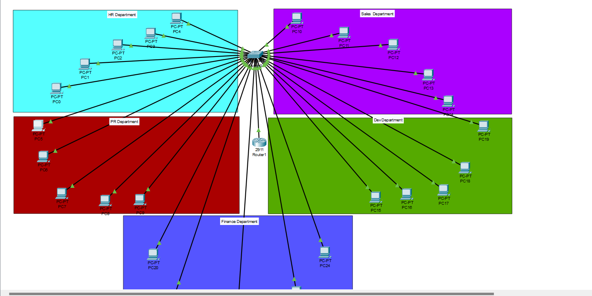

<u>Inter-VLAN Routing with DHCP (Router-on-a-Stick)</u>

Youssef Mahmoud Elsaeed

<u>First the required was:</u>

Create VLANs for the following departments:

- HR (VLAN 10)

- Sales (VLAN 20)

- DEV (VLAN 30)

- PR (VLAN 40)

- Finance (VLAN 50)

Assign 5 PCs to each VLAN.

Configure a trunk link between the router and the switch to allow
VLAN-tagged traffic.

Set up Router-on-a-Stick on the router to enable inter-VLAN routing.

Topology Requirements

- 1 Router

- 1 Switch

- 25 PCs (5 for each of the 5 VLANs)

- 1 Trunk Link between the router and switch

So now let’s dive in on what we did:

First things first the topology

- 

1.  created 5 VLANs to separate departments:

- VLAN 10 → HR

- VLAN 20 → Sales

- VLAN 30 → DEV

- VLAN 40 → PR

- VLAN 50 → Finance

Each PC port on the switch was assigned to its respective VLAN using:

switchport mode access

switchport access vlan \<ID\>

2.  **Router-on-a-Stick Configuration**

The router’s g0/0 interface was divided into **subinterfaces**, one for
each VLAN.  
Example for VLAN 10:

interface g0/0.10

encapsulation dot1Q 10

ip address 192.168.10.1 255.255.255.0

3.  We configured the router to provide IPs dynamically using **DHCP
    pools**.

> -although we could ve used a server as the past lab but I though it’s
> required to use only router and a switch.

4.  And finally testing:

PCs were set to **DHCP** mode.

Each PC received an IP from the correct VLAN range:

- HR → 192.168.10.x

- Sales → 192.168.20.x

- DEV → 192.168.30.x

- PR → 192.168.40.x

- Finance → 192.168.50.x

>  alt="A computer screen shot of a computer screen AI-generated content may be incorrect." />
>
>  alt="A screenshot of a computer AI-generated content may be incorrect." />
>
>  alt="A screenshot of a computer AI-generated content may be incorrect." />

5.  Now to the pinging:

>  alt="A screenshot of a computer AI-generated content may be incorrect." />

6.  Notice I pinged two differect vlans from pc 5 in vlan 30 (PR
    department) and it did ping so we are done.
