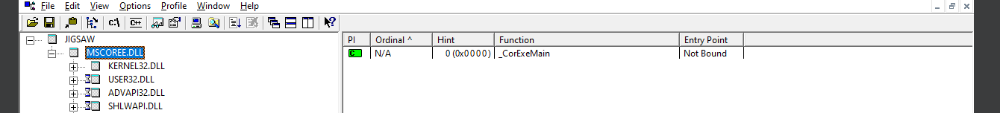

**Malware analysis Project**

Youssef Mahmoud Elsaeed

<u>Malware Sample</u>: <u>Jigsaw</u> - A ransomware strain named after
the antagonist in the movie "Saw," known for deleting files
incrementally until a ransom is paid, aiming to pressure victims into
payment.

<u>Nature:</u> Ransomware – Trojan

<u>FileType:</u> Executable

<u>Information About Malware (Discovered)</u>: Through our investigation
and extracting of the hash of the malware we managed to get some
information from Websites-Static analysis tools: Virus Total, Malware
Bazar, Strings, PE Viewer, Quick Hash and more :

- <u>FileSize</u>:  
  283.50 KB (290304 bytes)

- <u>MD5-Hash</u>(IOC): 2773e3dc59472296cb0024ba7715a64e

- <u>Sha256-Hash</u>(IOC):
  3ae96f73d805e1d3995253db4d910300d8442ea603737a1428b613061e7f61e7

- <u>Sha1-Hash</u>(IOC): 27d99fbca067f478bb91cdbcb92f13a828b00859

- <u>CompileTime</u>: 2016-03-31 06:28:14

- <u>Imports</u>: mscore.dll(DLL) 🡪 \_CoreExeMain (Function) :
  Initializes the common language runtime (CLR), locates the managed
  entry point in the executable assembly's CLR header, and begins
  execution.

- <u>PE header Sections</u> (5):

  - ‑!mmUPp (Suspicious)

  - .text

  - .rsrc

  - .reloc (Suspicious)

  - \- (Suspicious)

- <u>Strings(Saw first, was a big sign of something malicious)</u>:

  - BitcoinBlackmailer.exe

  - EncryptionFileExtension

  - EncryptionPassword

  - 14.0.0.0

  - FireFox

  - 4.0.0.0

  - System.Net

  - 37.0.2.5583

Okay first of all let’s talk about the proposal and the output.

--Wanted list:

- Proposal wanted in the pdf: Identify ransomware strings (e.g.,
  encryption calls).

- Output wanted in the pdf: Encryption key/IOCs

<u>Tools Used</u>:

- <u>QuickHash</u>

- <u>WinMD5</u>

- <u>PE Viewer</u>

- <u>Strings</u>

- <u>BinText</u>

- <u>Floss64 (No New info found)</u>

- <u>ResourceHacker</u>

- <u>DependencyWalker</u>

- [MalwareBazar
  Website](https://bazaar.abuse.ch/sample/3ae96f73d805e1d3995253db4d910300d8442ea603737a1428b613061e7f61e7/#iocs)

- [VirusTotal
  Website](https://www.virustotal.com/gui/file/3ae96f73d805e1d3995253db4d910300d8442ea603737a1428b613061e7f61e7/details)

- IDA PRO

- SystemInformer

- WireShark

- ProcMon

- ProcessExplorer

- RegShot

Now we’ll divide our report into two sections step by step what we’ve
done throughout the analysis but first let’s dive into our safety
precautions:

1.  we’ve initialized our VM to be totally safe so we did:

    1.  Snapshot before run.

    2.  Disabled antivirus on the Guest machine.

    3.  Disabled shared folders, drag and drop, clipboard sharing.

    4.  Did run the vm in the HOST-ONLY mode.

    5.  And did Air-Gapped technique and disabled any internet or plugs
        or any thing that could create interference between guest, host
        and the internet so we disconnected everything.

**<u>Static Analysis:</u>**

1.  First thing we needed is the file hash so we used QuickHash Tool,
    WinMD5 Tool to get the hash and search VirusTotal, MalwareBazar with
    that hash to get more information about it.

2.  Second thing PE Studio to check the PE file Headers and sections and
    check if there is any anomaly in that case and found some
    interesting facts:

    1.  5 Headers.

    2.  3 of those headers detected as suspicious.

    3.  1 header with special characters.

    4.  And one header
        additional.

    5.  Known the compile time.

    6.  

    7.  Here comes the interesting part as we’ve found our headers and
        it looks weird.

3.  So the third step is that we’ve used Strings to find the strings of
    those headers and discover if it’s suspicious and the results is:

    1.  Yes there is absolutely suspicious headers in that exe.

    2.  

    3.  

    4.  

    5.  So according to the strings of the .text header we’ve concluded
        that that ofcourse is a malicious exe but why?

    6.  Because of some of those strings like BitcoinBlackmailer.exe,
        all those encryption strings and functions, bitcoin addresses,
        ransome tags, that made us make a first overview that this
        malware is probably a ransomeware, encrypting files to get
        bitcoin as a transaction.

    7.  We’ve also found some ipaddresses and some .net strings:

    8.  

    9.  So looks like that malware deals with internet, maybe command
        and control, maybe a lot.

    10. But that IP: 37.0.2.5583 is suspected to be a command and
        control Server.

    11. One more strange string was that Firefox one.

4.  After we were done with PEviewer and strings tools and made sure
    that this is a malware and took some notes of it’s nature we dived
    into 4th step.

5.  Fourth step we’ve decided to try more tools like Bintext to check if
    we can find any thing additional and we did find some super
    interesting thing:

    1.  

    2.  We did find those on bintext which is the ransome note and we
        did understand everything about what that ransomeware wants from
        the user and what could happen when we do execute it.

    3.  The malware author wants bitcoin in order to decrypt the files
        that was encrypted by the malware and left quite a nice note.

6.  Fifth step Now to know more about the behavior we wanted to check
    the imports, Dlls and more information about that exe so we’ve used
    DependencyWalker tool to check those and found some too:

    1.  

    2.  One main import MSCOREE.DLL looks suspicious.

    3.  

    4.  Includes 1 main Function from that library \_CorExeMain
        initializes the CLR header to begin the execute which is
        definitely suspicious.

    5.  

    6.  

    7.  Those are the functions used from the kernel32.dll import and
        nothing suspicious.

    8.  

    9.  The usage of the Advapi32.DLL import itself is suspicious but
        the most interesting is it’s functions which includes regopeners
        and reg manipulation so that exe changes and manipulates
        registries definitely.

    10. 

    11. 

    12. The full path view of those DLLS.

    13. 

    14. Now we want nothing else from dependency walker.

7.  So one last check is resourcehacker tool to check that we wont find
    anything new from our static analysis but we did find only one thing
    to be remarked:

    1.  

    2.  And as we’ve said up there that Firefox string was suspicious so
        it looks like that malware is pretending to be FireFox and
        acting as a **<u>Trojan</u>** too that is another info about it.

8.  Okay after we’d finished our dependencywalker, ResourceHacker
    Invistigation and found out some information about the behavior of
    our exe now we need to move to the Second main section Which is the
    Dynamic analysis to know more details about it’s behavior.

    1.  SideNote: ofcourse detected obfuscation because we’ve found so
        much base64 encoded strings.

9.  We also did the Last Static analysis method which is using IDA pro
    to try to reverse engineer or find anything new but nothing was
    found .

    1.  

**<u>Dynamic Analysis:</u>**

1.  First step we did is to initialize all our tools to be ready for the
    hit and after our solid static analysis we are now so familiar with
    the behavior and what to expect from that exe file so we Initialized
    our tools which is:

    1.  SystemInformer

    2.  WireShark

    3.  ProcMon

    4.  ProcessExplorer

    5.  RegShot (1St Shot taken)

2.  After we’ve launchec our Dynamic testing environment we are going to
    launch the EXE and see what will we notice first:

    1.  The exe requires .net 3.5 framework to be launched which means
        it might be acting as firefox really.

    2.  As we were already expecting the behavior it did run as we
        expected.

    3.  No extra usage of any hardware except for the cpu it did
        increase it by 4 % which isn’t that remarkable.

3.  So the malware did register our software number as one of the
    victims:

4.  The parent JIGSAW.exe got the child process drpbx.exe which is our
    first important notice because it was one of the strings we found
    earlier.

5.  The text box which we’d found earlier appeared with a non
    controllable
    exits:

6.  The process could’nt be killed ofcourse, the view encrypted files
    button shows you the files that malware encrypted and it’s
    encryption is quite interesting.

    1.  The malware encrypts files with extension .FUN
        :

    2.  It already encrypted my lab 10-01 file and renaming the file
        isn’t going to do any changes.

7.  But the most important note we realized is that the child process
    drpbx.exe was doing the encryption in the back with this sequence
    CREATE, CHANGE, DELETE which is super important because we’ve known
    the mechanism it works with, it does create an encrypted version of
    your file, and then deletes your original file to only leave the
    encrypted on your system which is pretty
    smart.

8.  Hidden under it’s child
    process.

9.  Okay now to the other tools notes too like anyrun environment,
    regshot and others:

    1.  The jigsaw.exe changes the autorun value in registry (HKCU)
        currentversion/run:

    2.  Now with the changes in registries in
        regshot:

    3.  Ofcourse some was deleted but the most was changes in general
        :

10. So after we’ve studied the behavior of that malware and totally
    understanded the consequences and it’s behavior Our analysis is now
    finished and that report concluded every single detail about the
    Jigsaw Ransomware.

***<u>The conclusion & Recovery:</u>***

That ransomware is dangerous?

-Yes it is because of various reasons.

How to recover?

-Decryptors application softwares that was made by professionals that
analyzed that ransomware before and there is more than one famous
decryptor.

**<u>Indicators of compromise (IOCS) & Encryption Key:</u>**

1.  **<u>File Hashes:</u>**

- Sha-256:
  3ae96f73d805e1d3995253db4d910300d8442ea603737a1428b613061e7f61e7

- Sha-1: 27d99fbca067f478bb91cdbcb92f13a828b00859

- MD5: 2773e3dc59472296cb0024ba7715a64e

2.  **<u>IP Addresses:</u>**

- 14.0.0.0

- 4.0.0.0

- 37.0.2.5583

> 3.<u>Encryption Key:</u>

- <u>@WanaDecryptor@2016 (From Strings)</u>

4.<u>Encryption Calls</u>: In the strings there is a lot that was found.

**<u>Behavior
Graph:</u>**
